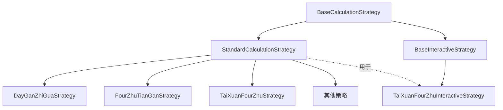

# 策略架构审查 (Strategy Architecture Review)

## 1. 架构概述

本项目采用了一种高度模块化和可扩展的策略模式 (Strategy Pattern) 来管理各种复杂的数术计算逻辑。核心架构围绕 `BaseCalculationStrategy` 展开，区分了"标准计算"和"交互式计算"两大类，并提供了灵活的"条文列表计算"配置机制。

## 2. 核心组件

### 2.1 基础策略接口 (`BaseCalculationStrategy`)

* **职责**：定义所有计算策略的公共接口。
* **核心属性**：
  * `name`, `description`, `detailSteps`: 描述信息。
  * `category`: 策略分类（`standard` 或 `interactive`）。
  * `defaultTiaoWenCalculationConfig`: 默认的条文扩展配置。
* **核心方法**：
  * `calculateTiaoWenListWithConfig`: 根据基础数和配置生成最终条文列表。

### 2.2 标准计算策略 (`StandardCalculationStrategy`)

* **职责**：处理一次性、非交互式的计算逻辑。
* **泛型**：`
`。
* **核心方法**：
  * `calculate(P params)`: 执行核心计算，返回结果 `R`。
  * `calculateTiaoWenList`: 默认条文生成逻辑。

### 2.3 交互式计算策略 (`BaseInteractiveStrategy`)

* **职责**：处理通过多步向导与用户交互的计算逻辑。
* **依赖**：`InteractiveSession`, `InteractiveStrategyConfig`。
* **核心方法**：
  * `startSession`: 启动会话。
  * `getCandidates`: 获取当前步骤选项。
  * `selectCandidate`: 用户做出选择。
  * `completeCalculation`: 完成交互并返回最终结果。

### 2.4 条文列表计算 (`TiaoWenListCalculation`)

* **职责**：处理从"基础数"到"条文列表"的扩展逻辑（如 +/- 96, +/- 48 等）。
* **配置类**：`TiaoWenListCalculationConfig` / `GenericTiaoWenCalculationConfig`。
* **常见模式**：
  * `increment96x4`: +0, +96, +192, +288, +384
  * `decrement96x4`: +0, -96, -192, -288, -384
  * `addSub48x`: ±48 x [2, 4, 8, 16]
  * `customList`: 自定义偏移列表。

## 3. 继承关系图

## 4. 审查结论

* **设计模式**：策略模式应用得当，有效地隔离了不同算法的复杂性，同时提供了统一的调用接口。
* **交互式支持**：`BaseInteractiveStrategy` 的设计非常超前，支持状态保存、回退、分支跳转，为复杂的数术排盘提供了极佳的用户体验基础。
* **配置灵活性**：`TiaoWenListCalculationConfig` 将"基础数计算"与"条文扩展"解耦，使得同一种起卦法可以配合不同的条文生成规则，增加了系统的灵活性。
* **代码质量**：代码结构清晰，注释详尽，类型安全（使用了泛型和强类型枚举）。
