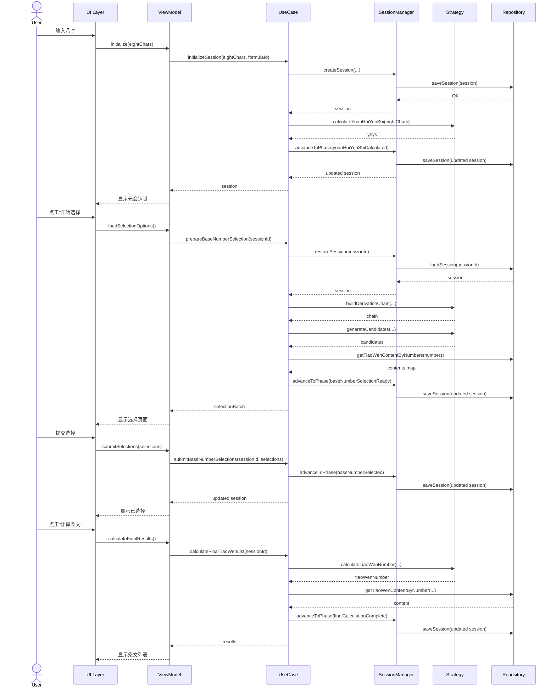

# 皇极取数法 V2 架构设计文档

## 1. 架构概述

### 1.1 设计原则
- **分离关注点**: Strategy 负责计算，Manager 负责状态，UseCase 负责编排
- **单一职责**: 每个类只负责一个明确的职责
- **依赖倒置**: 依赖抽象接口而非具体实现
- **开闭原则**: 对扩展开放，对修改关闭 (通过 JSON 配置扩展公式)

### 1.2 架构风格
- **MVVM**: Model-View-ViewModel 模式
- **Clean Architecture**: 分层架构，依赖关系从外向内
- **Repository Pattern**: 数据访问抽象

---

## 2. 分层设计

### 2.1 四层架构

```
┌───────────────────────────────────────────────────────────────┐
│                      Presentation Layer                       │
│  ┌─────────────┐  ┌─────────────┐  ┌─────────────────────┐   │
│  │   Pages     │  │   Widgets   │  │    ViewModels       │   │
│  │   (UI)      │  │ (Components)│  │ (State Management)  │   │
│  └─────────────┘  └─────────────┘  └─────────────────────┘   │
└───────────────────────────────────────────────────────────────┘
                             ↓ (依赖)
┌───────────────────────────────────────────────────────────────┐
│                     Application Layer                         │
│  ┌─────────────────────────┐  ┌──────────────────────────┐   │
│  │       UseCases          │  │       Managers           │   │
│  │ (Business Orchestration)│  │  (State Management)      │   │
│  └─────────────────────────┘  └──────────────────────────┘   │
└───────────────────────────────────────────────────────────────┘
                             ↓ (依赖)
┌───────────────────────────────────────────────────────────────┐
│                        Domain Layer                           │
│  ┌─────────────────┐  ┌─────────────────┐  ┌─────────────┐   │
│  │     Models      │  │    Entities     │  │   Enums     │   │
│  │ (Data Structures│  │(Business Objects│  │             │   │
│  └─────────────────┘  └─────────────────┘  └─────────────┘   │
└───────────────────────────────────────────────────────────────┘
                             ↓ (依赖)
┌───────────────────────────────────────────────────────────────┐
│                   Infrastructure Layer                        │
│  ┌──────────────┐  ┌──────────────┐  ┌──────────────────┐    │
│  │ Repositories │  │  Strategies  │  │    Services      │    │
│  │(Data Access) │  │(Calculation) │  │(External Deps)   │    │
│  └──────────────┘  └──────────────┘  └──────────────────┘    │
└───────────────────────────────────────────────────────────────┘
```

### 2.2 依赖规则
- **Presentation** 依赖 → Application, Domain
- **Application** 依赖 → Domain, Infrastructure (通过接口)
- **Domain** 依赖 → 无 (核心层，最稳定)
- **Infrastructure** 依赖 → Domain

---

## 3. 核心组件设计

### 3.1 Strategy 层 (Infrastructure/Service)

#### 职责
- **纯计算逻辑**: 只负责数学运算，不涉及状态管理
- **无副作用**: 函数式编程风格，相同输入必然产生相同输出
- **可测试性**: 易于单元测试

#### 核心接口

```dart
/// 皇极计算策略接口
abstract class HuangJiCalculationStrategy {
  /// 计算元会运世
  /// 输入: 四柱八字
  /// 输出: YuanHuiYunShi 对象
  YuanHuiYunShi calculateYuanHuiYunShi(EightChars eightChars);

  /// 生成候选列表
  /// 输入: 初刻数 + 配置 (偏移量、数量、范围)
  /// 输出: 候选数值列表 (不含条文内容)
  /// 算法: initialNumber ± offset*N, N=0..count
  List<BaseNumberCandidate> generateCandidates({
    required int initialNumber,
    required CandidateGenerationConfig config,
  });

  /// 计算派生基础数
  /// 输入: 基础数定义 + 元会运世数据
  /// 输出: 派生后的数值
  /// 算法: 根据定义中的 parts 累加计算
  int calculateDerivedBaseNumber({
    required DataBaseNumberDefinition baseDefinition,
    required YuanHuiYunShi yhys,
  });

  /// 计算条文数
  /// 输入: 基础数 + 条文公式
  /// 输出: 最终条文数
  /// 算法: baseNumber + sum(formula.parts)
  int calculateTiaoWenNumber({
    required int baseNumber,
    required TiaoWenFormulaData formula,
  });

  /// 构建派生链路
  /// 输入: 基础数定义 + 元会运世数据
  /// 输出: 派生链路对象
  /// 算法: 递归追溯到 PredefinedBaseNumber，记录每步操作
  BaseNumberDerivationChain buildDerivationChain({
    required DataBaseNumberDefinition definition,
    required YuanHuiYunShi yhys,
  });
}
```

#### 实现类

```dart
class HuangJiCalculationStrategyImpl implements HuangJiCalculationStrategy {
  @override
  YuanHuiYunShi calculateYuanHuiYunShi(EightChars eightChars) {
    // 委托给现有的 YuanHuiYunShi.fromEightChars
    return YuanHuiYunShi.fromEightChars(eightChars);
  }

  @override
  List<BaseNumberCandidate> generateCandidates({
    required int initialNumber,
    required CandidateGenerationConfig config,
  }) {
    final candidates = <BaseNumberCandidate>[];

    // 生成前后各 count 个候选项
    for (int i = -config.count; i <= config.count; i++) {
      final number = initialNumber + (i * config.offset);

      // 过滤范围
      if (number < config.minValue || number > config.maxValue) {
        continue;
      }

      candidates.add(BaseNumberCandidate(
        id: 'candidate_${number}',
        number: number,
        offsetFromInitial: i * config.offset,
        tiaoWenContent: '', // 后续填充
        isInitial: i == 0,
      ));
    }

    return candidates;
  }

  @override
  BaseNumberDerivationChain buildDerivationChain({
    required DataBaseNumberDefinition definition,
    required YuanHuiYunShi yhys,
  }) {
    // 递归追溯
    if (definition is DataPredefinedBaseNumber) {
      // 已到达根源
      return BaseNumberDerivationChain(
        source: definition,
        derivationSteps: [],
        finalDefinition: definition,
      );
    } else if (definition is DataDerivedBaseNumber) {
      // 继续追溯父级
      final parentChain = buildDerivationChain(
        definition: definition.baseNumberDefinition,
        yhys: yhys,
      );

      // 添加当前派生步骤
      final step = DerivationStep(
        operation: _buildOperationDescription(definition.calculationParts),
        value: definition.calculationParts.fold(0, (sum, part) => sum + part.rawNumber),
        description: definition.description,
      );

      return BaseNumberDerivationChain(
        source: parentChain.source,
        derivationSteps: [...parentChain.derivationSteps, step],
        finalDefinition: definition,
      );
    } else if (definition is DataSelectableBaseNumber) {
      // Selectable 包装了另一个定义
      return buildDerivationChain(
        definition: definition.initialCandidate,
        yhys: yhys,
      );
    }

    throw UnsupportedError('Unknown BaseNumberDefinition type');
  }

  String _buildOperationDescription(List<DataCalculationPart> parts) {
    // 例如: "+年干*1000+月干*100"
    return parts.map((part) => '+${part.name}').join('');
  }
}
```

---

### 3.2 Manager 层 (Application)

#### 职责
- **状态管理**: 管理 Session 生命周期
- **快照管理**: 创建和恢复快照
- **持久化**: 调用 Repository 保存/加载
- **阶段控制**: 管理阶段转换

#### 核心接口

```dart
class HuangJiV2SessionManager {
  final SessionRepository _sessionRepository;
  final HuangJiCalculationStrategy _calculationStrategy;

  /// 创建新 Session
  Future<HuangJiV2Session> createSession({
    required EightChars eightChars,
    required HuangJiCalculationFormula formula,
    String? sessionName,
  }) async {
    final sessionId = _generateSessionId();
    final now = DateTime.now();

    final session = HuangJiV2Session(
      sessionId: sessionId,
      sessionName: sessionName ?? 'Session_$sessionId',
      eightChars: eightChars,
      formulas: [formula],
      yuanHuiYunShi: null, // 将在后续步骤计算
      startTime: now,
      lastActivityAt: now,
      status: HuangJiV2SessionStatus.notStarted,
      currentPhase: SessionPhase.initialized,
      baseNumberSelections: {},
      phaseHistory: [],
    );

    await _sessionRepository.saveSession(session);
    return session;
  }

  /// 推进到下一阶段
  Future<HuangJiV2Session> advanceToPhase({
    required HuangJiV2Session session,
    required SessionPhase targetPhase,
  }) async {
    // 验证阶段转换合法性
    _validatePhaseTransition(session.currentPhase, targetPhase);

    // 创建当前阶段快照
    final snapshot = createSnapshot(session);

    // 更新 Session
    final updatedSession = session.copyWith(
      currentPhase: targetPhase,
      phaseHistory: [...session.phaseHistory, snapshot],
      lastActivityAt: DateTime.now(),
    );

    await _sessionRepository.saveSession(updatedSession);
    return updatedSession;
  }

  /// 创建快照
  SessionSnapshot createSnapshot(HuangJiV2Session session) {
    return SessionSnapshot(
      snapshotId: 'snapshot_${DateTime.now().millisecondsSinceEpoch}',
      phase: session.currentPhase,
      timestamp: DateTime.now(),
      state: session.toJson(), // 完整序列化
    );
  }

  /// 回滚到快照
  Future<HuangJiV2Session> rollbackToSnapshot({
    required HuangJiV2Session session,
    required String snapshotId,
  }) async {
    // 查找快照
    final snapshot = session.phaseHistory.firstWhere(
      (s) => s.snapshotId == snapshotId,
      orElse: () => throw Exception('Snapshot not found'),
    );

    // 从快照恢复
    final restoredSession = HuangJiV2Session.fromJson(snapshot.state);

    // 保留快照历史 (截断到该快照之前)
    final snapshotIndex = session.phaseHistory.indexOf(snapshot);
    final truncatedHistory = session.phaseHistory.sublist(0, snapshotIndex + 1);

    final finalSession = restoredSession.copyWith(
      phaseHistory: truncatedHistory,
      lastActivityAt: DateTime.now(),
    );

    await _sessionRepository.saveSession(finalSession);
    return finalSession;
  }

  void _validatePhaseTransition(SessionPhase current, SessionPhase target) {
    // 定义合法的阶段转换
    final validTransitions = {
      SessionPhase.initialized: [SessionPhase.yuanHuiYunShiCalculated],
      SessionPhase.yuanHuiYunShiCalculated: [SessionPhase.baseNumberSelectionReady],
      SessionPhase.baseNumberSelectionReady: [SessionPhase.baseNumberSelected],
      SessionPhase.baseNumberSelected: [SessionPhase.finalCalculationComplete],
    };

    if (!validTransitions[current]?.contains(target) ?? true) {
      throw InvalidPhaseTransitionException(current, target);
    }
  }

  String _generateSessionId() {
    return 'session_${DateTime.now().millisecondsSinceEpoch}';
  }
}
```

---

### 3.3 UseCase 层 (Application)

#### 职责
- **业务编排**: 协调 Strategy、Manager、Repository
- **流程控制**: 实现完整的业务流程
- **数据转换**: 在不同层之间转换数据格式
- **异常处理**: 统一处理业务异常

#### 核心实现

```dart
class HuangJiInteractiveUseCase {
  final HuangJiV2SessionManager _sessionManager;
  final HuangJiCalculationStrategy _calculationStrategy;
  final TiaoWenRepository _tiaoWenRepository;
  final HuangJiFormulaManager _formulaManager;

  /// 步骤1: 初始化 Session
  Future<HuangJiV2Session> initializeSession({
    required EightChars eightChars,
    required int formulaId,
    String? sessionName,
  }) async {
    // 1. 加载公式模板
    final formula = await _formulaManager.getFormulaById(formulaId);

    // 2. 创建 Session
    var session = await _sessionManager.createSession(
      eightChars: eightChars,
      formula: formula,
      sessionName: sessionName,
    );

    // 3. 计算元会运世
    final yhys = _calculationStrategy.calculateYuanHuiYunShi(eightChars);

    // 4. 更新 Session
    session = session.copyWith(yuanHuiYunShi: yhys);

    // 5. 推进阶段
    session = await _sessionManager.advanceToPhase(
      session: session,
      targetPhase: SessionPhase.yuanHuiYunShiCalculated,
    );

    return session;
  }

  /// 步骤2: 准备基础数选择 (核心逻辑)
  Future<BaseNumberSelectionBatch> prepareBaseNumberSelection(
    String sessionId,
  ) async {
    // 1. 加载 Session
    final session = await _sessionManager.restoreSession(sessionId);
    if (session == null) throw SessionNotFoundException(sessionId);

    final yhys = session.yuanHuiYunShi!;
    final formula = session.formulas.first;

    // 2. 转换为 DataFormula
    final dataFormula = formula.toData(yhys);

    // 3. 收集唯一定义 (去重逻辑)
    final uniqueDefinitions = <String, BaseNumberSelectionItem>{};
    final definitionToGroups = <String, List<String>>{};

    for (final group in dataFormula.groups) {
      final baseNumDef = group.baseNumberDefinition;

      // 判断是否需要选择
      if (!_requiresUserSelection(baseNumDef)) continue;

      // 使用 name 作为唯一 ID (关键!)
      final definitionId = baseNumDef.name;

      // 记录 group 关联
      definitionToGroups.putIfAbsent(definitionId, () => []).add(group.groupId);

      // 去重: 如果已存在，跳过
      if (uniqueDefinitions.containsKey(definitionId)) continue;

      // 4. 构建派生链路
      final chain = _calculationStrategy.buildDerivationChain(
        definition: baseNumDef,
        yhys: yhys,
      );

      // 5. 生成候选列表 (不含条文内容)
      final config = CandidateGenerationConfig(
        initialNumber: baseNumDef.number,
        offset: 30,
        count: 10,
        minValue: 1000,
        maxValue: 13000,
      );
      final candidates = _calculationStrategy.generateCandidates(
        initialNumber: baseNumDef.number,
        config: config,
      );

      // 6. 批量查询条文内容
      final numbers = candidates.map((c) => c.number).toList();
      final contents = await _tiaoWenRepository.getTiaoWenContentByNumbers(numbers);

      // 7. 合并数值和内容
      final candidatesWithContent = candidates.map((c) {
        return c.copyWith(
          tiaoWenContent: contents[c.number] ?? '条文未找到',
        );
      }).toList();

      // 8. 创建选择项
      uniqueDefinitions[definitionId] = BaseNumberSelectionItem(
        definitionId: definitionId,
        name: baseNumDef.name,
        description: baseNumDef.description,
        derivationChain: chain,
        candidates: candidatesWithContent,
        relatedGroupIds: definitionToGroups[definitionId]!,
      );
    }

    // 9. 更新 Session 阶段
    await _sessionManager.advanceToPhase(
      session: session,
      targetPhase: SessionPhase.baseNumberSelectionReady,
    );

    return BaseNumberSelectionBatch(
      items: uniqueDefinitions.values.toList(),
      definitionToGroupsMap: definitionToGroups,
    );
  }

  /// 判断是否需要用户选择
  bool _requiresUserSelection(DataBaseNumberDefinition def) {
    if (def is DataSelectableBaseNumber) return true;
    if (def is DataDerivedBaseNumber) {
      return _requiresUserSelection(def.baseNumberDefinition);
    }
    return false;
  }

  /// 步骤3: 提交选择
  Future<HuangJiV2Session> submitBaseNumberSelections({
    required String sessionId,
    required Map<String, String> selections, // definitionId -> candidateId
  }) async {
    // 1. 加载 Session
    var session = await _sessionManager.restoreSession(sessionId);
    if (session == null) throw SessionNotFoundException(sessionId);

    // 2. 重新生成选择批次 (获取完整的候选信息)
    final batch = await prepareBaseNumberSelection(sessionId);

    // 3. 验证并构建选择记录
    final selectionRecords = <String, BaseNumberSelectionRecord>{};

    for (final item in batch.items) {
      final candidateId = selections[item.definitionId];
      if (candidateId == null) {
        throw IncompleteSelectionException([item.definitionId]);
      }

      final candidate = item.candidates.firstWhere(
        (c) => c.id == candidateId,
        orElse: () => throw Exception('Candidate not found: $candidateId'),
      );

      selectionRecords[item.definitionId] = BaseNumberSelectionRecord(
        baseNumberDefinitionId: item.definitionId,
        name: item.name,
        derivationChain: item.derivationChain,
        candidateConfig: CandidateGenerationConfig(
          initialNumber: item.derivationChain.finalDefinition.number,
          offset: 30,
          count: 10,
          minValue: 1000,
          maxValue: 13000,
        ),
        candidates: item.candidates,
        selectedCandidate: candidate,
        status: SelectionStatus.completed,
        relatedGroupIds: item.relatedGroupIds,
      );
    }

    // 4. 更新 Session
    session = session.copyWith(
      baseNumberSelections: selectionRecords,
    );

    // 5. 推进阶段
    session = await _sessionManager.advanceToPhase(
      session: session,
      targetPhase: SessionPhase.baseNumberSelected,
    );

    return session;
  }

  /// 步骤4: 计算最终条文
  Future<List<TiaoWenResult>> calculateFinalTiaoWenList(
    String sessionId,
  ) async {
    // 1. 加载 Session
    var session = await _sessionManager.restoreSession(sessionId);
    if (session == null) throw SessionNotFoundException(sessionId);

    final yhys = session.yuanHuiYunShi!;
    final formula = session.formulas.first;
    final dataFormula = formula.toData(yhys);

    // 2. 遍历所有 groups，计算条文
    final results = <TiaoWenResult>[];

    for (final group in dataFormula.groups) {
      // 3. 确定基础数
      final baseNumDef = group.baseNumberDefinition;
      final definitionId = baseNumDef.name;
      final selectionRecord = session.baseNumberSelections[definitionId];

      int baseNumber;
      if (selectionRecord != null && selectionRecord.selectedCandidate != null) {
        // 使用用户选择的值
        baseNumber = selectionRecord.selectedCandidate!.number;
      } else {
        // 使用默认计算值
        baseNumber = baseNumDef.number;
      }

      // 4. 遍历公式计算条文
      for (final formulaData in group.dataFormulas) {
        final tiaoWenNumber = _calculationStrategy.calculateTiaoWenNumber(
          baseNumber: baseNumber,
          formula: formulaData,
        );

        final content = await _tiaoWenRepository.getTiaoWenContentByNumber(tiaoWenNumber);

        results.add(TiaoWenResult(
          groupId: group.groupId,
          formulaName: formulaData.name,
          baseNumber: baseNumber,
          tiaoWenNumber: tiaoWenNumber,
          tiaoWenContent: content ?? '条文未找到 (${tiaoWenNumber})',
          calculationDetail: '$baseNumber + ${formulaData.description} = $tiaoWenNumber',
        ));
      }
    }

    // 5. 更新 Session
    session = session.copyWith(finalTiaoWenList: results);
    session = await _sessionManager.advanceToPhase(
      session: session,
      targetPhase: SessionPhase.finalCalculationComplete,
    );

    return results;
  }
}
```

---

### 3.4 Repository 层 (Infrastructure)

#### SessionRepository

```dart
/// Session 仓库接口
abstract class SessionRepository {
  Future<void> saveSession(HuangJiV2Session session);
  Future<HuangJiV2Session?> loadSession(String sessionId);
  Future<List<HuangJiV2Session>> getAllSessions();
  Future<void> deleteSession(String sessionId);
}

/// 内存实现 (用于初期开发和测试)
class InMemorySessionRepository implements SessionRepository {
  final Map<String, HuangJiV2Session> _storage = {};

  @override
  Future<void> saveSession(HuangJiV2Session session) async {
    _storage[session.sessionId] = session;
  }

  @override
  Future<HuangJiV2Session?> loadSession(String sessionId) async {
    return _storage[sessionId];
  }

  @override
  Future<List<HuangJiV2Session>> getAllSessions() async {
    return _storage.values.toList();
  }

  @override
  Future<void> deleteSession(String sessionId) async {
    _storage.remove(sessionId);
  }
}
```

---

## 4. 数据流设计

### 4.1 完整流程序列图



---

## 5. 关键设计决策

### 5.1 去重策略: 基于 name

**决策**: 使用 `BaseNumberDefinition.name` 作为唯一标识

**理由**:
- 简单直观，易于理解和调试
- 与 JSON 配置对齐 (name 在 JSON 中已定义)
- 避免复杂的 hash 计算或 JSON 序列化比较

**权衡**:
- 优点: 实现简单，性能好
- 缺点: 要求 JSON 配置中 name 必须唯一且有意义
- 替代方案: 基于内容 hash (更复杂但更安全)

### 5.2 快照设计: 完整序列化

**决策**: 快照的 `state` 字段存储 Session 的完整 JSON

**理由**:
- 保证回滚的完整性，无需部分恢复逻辑
- 简化实现，避免复杂的差异计算
- 便于调试和持久化

**权衡**:
- 优点: 简单可靠，易于实现
- 缺点: 存储空间较大
- 替代方案: 增量快照 (只存储变更)

### 5.3 Repository 接口化

**决策**: 定义抽象 Repository 接口，先实现内存版本

**理由**:
- 遵循依赖倒置原则
- 便于后续切换到文件/数据库存储
- 提高可测试性 (可 mock Repository)

**实现计划**:
- Phase 1: InMemorySessionRepository
- Phase 2: FileSessionRepository (JSON 文件)
- Phase 3: SqliteSessionRepository (SQLite 数据库)

---

## 6. 性能优化设计

### 6.1 批量查询条文

**问题**: 逐个查询条文内容效率低

**方案**: 新增 `getTiaoWenContentByNumbers(List<int>)` 批量接口

**优势**:
- 减少 I/O 次数
- 利用内存缓存 (TiaoWenRepositoryImpl 已有缓存)
- 提升用户体验 (候选列表加载更快)

### 6.2 候选列表缓存

**问题**: 重复生成相同的候选列表

**方案**: 在 `BaseNumberSelectionBatch` 生成后缓存到 Session

**优势**:
- 避免重复计算
- 用户返回选择页面时无需重新生成

---

## 7. 扩展性设计

### 7.1 新增公式支持

通过 JSON 配置扩展，无需修改代码:

```json
{
  "id": 4,
  "name": "皇极取数法四",
  "groups": [
    {
      "groupId": "新的计算组",
      "baseNumberDefinition": { ... },
      "formulas": [ ... ]
    }
  ]
}
```

### 7.2 新增选择类型

通过扩展 `SelectionType` 枚举和实现对应的逻辑:

```dart
enum SelectionType {
  predefinedBaseNumber,
  derivedBaseNumber,
  selectableBaseNumber,
  tiaoWenContent,
  custom,
  // 新增:
  conditionalSelection, // 条件选择
  multiSelection,       // 多选
}
```

---

## 8. 安全性设计

### 8.1 输入验证

- 八字合法性: 验证天干地支组合
- 候选项验证: 确保在有效范围内
- 选择完整性: 确保所有必需选择都已提交

### 8.2 异常处理

- 统一异常类型 (见需求文档第 7 节)
- 在 UseCase 层捕获并转换为用户友好的错误消息
- 记录详细日志供开发调试

---

## 9. 测试策略

### 9.1 单元测试

- **Strategy 层**: 测试所有计算逻辑
  - `generateCandidates`: 验证范围和数量
  - `buildDerivationChain`: 验证链路追溯
  - `calculateTiaoWenNumber`: 验证计算公式

### 9.2 集成测试

- **UseCase 层**: 测试完整业务流程
  - 端到端流程测试
  - 异常处理测试
  - 回滚功能测试

### 9.3 UI 测试

- **Widget 测试**: 测试关键组件
- **黄金测试**: 测试 UI 快照

---

## 10. 部署和维护

### 10.1 依赖管理

```yaml
dependencies:
  flutter:
    sdk: flutter
  json_annotation: ^4.8.0
  common: # 内部依赖

dev_dependencies:
  json_serializable: ^6.6.0
  build_runner: ^2.3.0
  flutter_test:
    sdk: flutter
```

### 10.2 代码生成

运行以下命令生成 JSON 序列化代码:

```bash
flutter pub run build_runner build --delete-conflicting-outputs
```

---

**文档版本**: v1.0
**创建时间**: 2025-01-XX
**审批状态**: 待审批
**维护者**: Architecture Team
