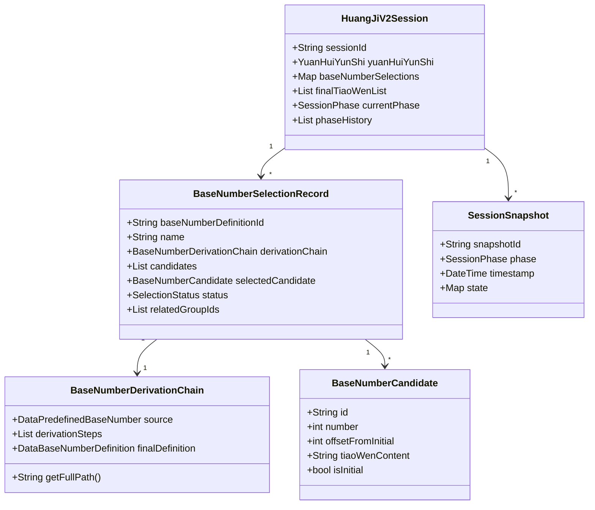
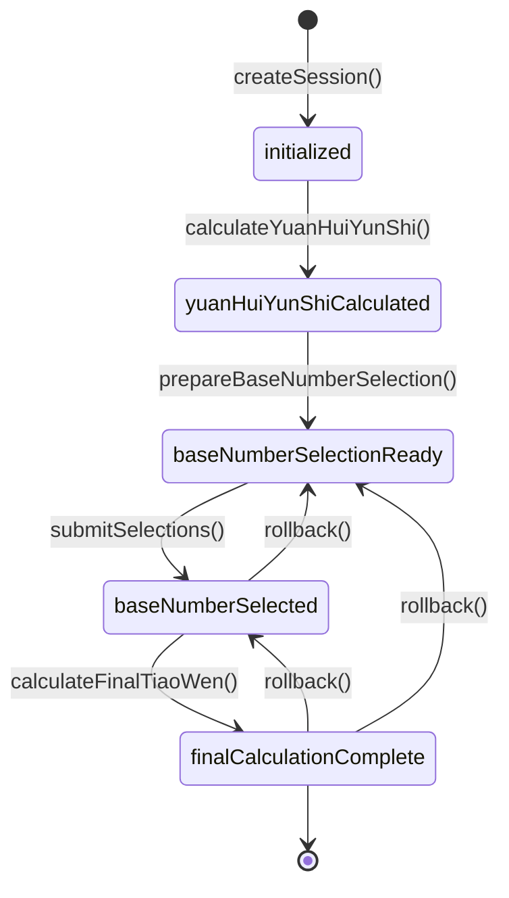

# 皇极取数法 V2 架构需求规格说明

## 1. 项目背景

### 1.1 现状
- 已有 `HuangJiCalculationFormula` 和 `HuangJiDataCalculationFormula` 数据模型
- 已有 `YuanHuiYunShi` 计算逻辑
- 已有 `TiaoWenRepository` 条文数据访问
- 缺乏完整的交互式计算流程和状态管理

### 1.2 目标
构建一个完整的皇极取数法交互式计算系统，支持：
1. 分阶段计算流程
2. 用户交互式选择基础数
3. Session 状态管理与持久化
4. 任意阶段回滚
5. 去重优化用户体验

---

## 2. 核心需求

### 2.1 功能需求

#### FR-1: 元会运世计算
- **输入**: 四柱八字 (`EightChars`)
- **处理**:
  - 调用 `YuanHuiYunShi.fromEightChars`
  - 计算元会基础数 (左旋)
  - 计算运世基础数 (右旋)
- **输出**: `YuanHuiYunShi` 对象
- **约束**: 必须保存在 Session 中供后续使用

#### FR-2: 基础数选择准备
- **输入**: `HuangJiV2Session` (包含 `YuanHuiYunShi`)
- **处理**:
  1. 遍历 `HuangJiCalculationFormula.groups`
  2. 提取所有 `baseNumberDefinition`
  3. **去重逻辑**:
     - 基于 `baseNumberDefinition.name` 判断唯一性
     - 记录每个唯一定义关联的 `groupId` 列表
  4. 对每个唯一定义:
     - 构建派生链路 (追溯到元会/运世)
     - 生成候选列表 (初刻数 ± 30*N, N=0..10)
     - 批量查询条文内容
- **输出**: `BaseNumberSelectionBatch`
  - 包含去重后的选择项列表
  - 包含定义到 groups 的映射关系
- **约束**:
  - 候选数值范围: 1000-13000
  - 默认生成前后各 10 个候选项 (共 21 个,包括初刻数)
  - 条文不存在时显示 "条文未找到"

#### FR-3: 用户选择提交
- **输入**:
  - Session ID
  - 选择映射 `Map<definitionId, candidateId>`
- **处理**:
  1. 验证所有必需选择都已提交
  2. 创建 `BaseNumberSelectionRecord` 记录
  3. 更新 Session 的 `baseNumberSelections`
  4. 更新 `currentPhase` 为 `baseNumberSelected`
  5. 创建快照
- **输出**: 更新后的 `HuangJiV2Session`
- **约束**:
  - 必须为所有 `isSelectable=true` 的定义提供选择
  - 记录完整的派生链路

#### FR-4: 最终条文计算
- **输入**: Session ID
- **处理**:
  1. 遍历所有 `CalculationGroup`
  2. 对每个 group:
     - 获取基础数 (用户选择值或默认计算值)
     - 对每个 `TiaoWenFormula`:
       - 计算条文数 = 基础数 + formula.parts 之和
       - 查询条文内容
  3. 收集所有结果
- **输出**: `List<TiaoWenResult>`
- **约束**:
  - 条文数需经过 `checkToTiaoWenNumber` 处理 (>13000 则 -12000)

#### FR-5: Session 状态管理
- **功能**:
  - 创建 Session
  - 保存 Session (持久化)
  - 恢复 Session
  - 阶段推进
  - 快照创建
  - 回滚
- **约束**:
  - 每次阶段变更必须创建快照
  - 快照包含完整状态，可独立恢复
  - 支持回滚到任意历史快照

#### FR-6: 派生链路追踪
- **功能**: 记录基础数的完整派生路径
- **示例**:
  ```
  元会基础数(2000)
  → +年干*1000(3000)
  → 派生基础数(5000)
  → 用户选择+30
  → 最终值(5030)
  ```
- **约束**: 必须可追溯到 `PredefinedBaseNumber` (元会或运世)

### 2.2 非功能需求

#### NFR-1: 性能
- 候选列表生成时间: < 500ms
- 条文批量查询时间: < 1s (100 个条文)
- Session 保存/恢复时间: < 200ms

#### NFR-2: 可维护性
- 严格遵循 MVVM 架构
- Strategy 层与业务逻辑解耦
- 所有 Model 支持 JSON 序列化

#### NFR-3: 可测试性
- Strategy 层 100% 单元测试覆盖
- UseCase 层集成测试覆盖核心流程

#### NFR-4: 可扩展性
- 支持新增计算公式 (通过 JSON 配置)
- Repository 接口化，支持切换存储方式

---

## 3. 技术规格

### 3.1 架构分层

```
┌─────────────────────────────────────────┐
│            Presentation Layer            │
│  ├─ Pages (UI)                          │
│  ├─ Widgets (Components)                │
│  └─ ViewModels (State Management)       │
└─────────────────────────────────────────┘
                    ↓
┌─────────────────────────────────────────┐
│           Application Layer              │
│  ├─ UseCases (Business Orchestration)   │
│  └─ Managers (State Management)         │
└─────────────────────────────────────────┘
                    ↓
┌─────────────────────────────────────────┐
│             Domain Layer                 │
│  ├─ Models (Data Structures)            │
│  └─ Entities (Business Objects)         │
└─────────────────────────────────────────┘
                    ↓
┌─────────────────────────────────────────┐
│          Infrastructure Layer            │
│  ├─ Repositories (Data Access)          │
│  ├─ Strategies (Pure Calculation)       │
│  └─ Services (External Dependencies)    │
└─────────────────────────────────────────┘
```

### 3.2 核心类图



### 3.3 状态机



---

## 4. 数据流设计

### 4.1 初始化流程

```
User Input (EightChars)
    ↓
HuangJiInteractiveUseCase.initializeSession()
    ↓
SessionManager.createSession()
    ├─ Generate sessionId
    └─ Create empty session
    ↓
CalculationStrategy.calculateYuanHuiYunShi()
    ├─ 计算元会基础数
    └─ 计算运世基础数
    ↓
Update Session
    ├─ Set yuanHuiYunShi
    ├─ Set currentPhase = yuanHuiYunShiCalculated
    └─ Create snapshot
    ↓
SessionRepository.saveSession()
    ↓
Return HuangJiV2Session
```

### 4.2 基础数选择流程 (核心)

```
UseCase.prepareBaseNumberSelection()
    ↓
Load Session from Repository
    ↓
Get HuangJiCalculationFormula
    ↓
Convert to HuangJiDataCalculationFormula (with YuanHuiYunShi)
    ↓
┌────────────────────────────────────────┐
│  遍历所有 CalculationGroup             │
│  ├─ 提取 baseNumberDefinition          │
│  ├─ 判断是否需要选择                   │
│  └─ 收集唯一定义 (基于 name)           │
└────────────────────────────────────────┘
    ↓
对每个唯一定义:
    ├─ CalculationStrategy.buildDerivationChain()
    │   ├─ 递归追溯到 PredefinedBaseNumber
    │   └─ 记录每步派生操作
    ├─ CalculationStrategy.generateCandidates()
    │   ├─ 初刻数 ± 30*N (N=0..10)
    │   └─ 过滤范围 1000-13000
    └─ TiaoWenRepository.getTiaoWenContentByNumbers()
        └─ 批量查询条文内容
    ↓
构建 BaseNumberSelectionBatch
    ├─ items: List<BaseNumberSelectionItem>
    └─ definitionToGroupsMap: Map<String, List<String>>
    ↓
Return to ViewModel/UI
```

### 4.3 去重逻辑详解

```dart
// 伪代码
Map<String, BaseNumberSelectionItem> uniqueDefinitions = {};
Map<String, List<String>> definitionToGroups = {};

for (group in dataFormula.groups) {
    baseNumDef = group.baseNumberDefinition;

    // 判断是否需要用户选择
    if (!requiresUserSelection(baseNumDef)) continue;

    // 使用 name 作为唯一 ID
    definitionId = baseNumDef.name; // 关键: 基于 name 去重

    // 记录关联的 groups
    if (!definitionToGroups.containsKey(definitionId)) {
        definitionToGroups[definitionId] = [];
    }
    definitionToGroups[definitionId].add(group.groupId);

    // 如果已存在，跳过 (去重)
    if (uniqueDefinitions.containsKey(definitionId)) continue;

    // 生成选择项
    item = createSelectionItem(baseNumDef);
    uniqueDefinitions[definitionId] = item;
}
```

**关键点**:
- `definitionId = baseNumDef.name`
- 一个定义可能被多个 groups 使用 (记录在 `relatedGroupIds`)
- 用户只需选择一次，选择值在所有相关 groups 中复用

### 4.4 条文计算流程

```
UseCase.calculateFinalTiaoWenList()
    ↓
Load Session
    ↓
Get HuangJiDataCalculationFormula
    ↓
For each CalculationGroup:
    ↓
    Get baseNumberDefinition
        ├─ definitionId = baseNumDef.name
        └─ selectionRecord = session.baseNumberSelections[definitionId]
    ↓
    Determine baseNumber:
        ├─ If selectionRecord exists:
        │   └─ baseNumber = selectionRecord.selectedCandidate.number
        └─ Else:
            └─ baseNumber = baseNumDef.number (直接计算值)
    ↓
    For each TiaoWenFormula in group.dataFormulas:
        ↓
        tiaoWenNumber = CalculationStrategy.calculateTiaoWenNumber(
            baseNumber: baseNumber,
            formula: formula
        )
        // tiaoWenNumber = baseNumber + sum(formula.parts)
        ↓
        content = TiaoWenRepository.getTiaoWenContentByNumber(tiaoWenNumber)
        ↓
        Create TiaoWenResult
    ↓
Collect all results
    ↓
Update Session
    ├─ Set finalTiaoWenList
    └─ Set currentPhase = finalCalculationComplete
    ↓
Return List<TiaoWenResult>
```

---

## 5. 接口规格

### 5.1 HuangJiCalculationStrategy

```dart
abstract class HuangJiCalculationStrategy {
  /// 计算元会运世
  YuanHuiYunShi calculateYuanHuiYunShi(EightChars eightChars);

  /// 生成候选列表 (不含条文内容)
  /// 返回值按偏移量排序: [..., -60, -30, 0, +30, +60, ...]
  List<BaseNumberCandidate> generateCandidates({
    required int initialNumber,
    required CandidateGenerationConfig config,
  });

  /// 计算派生基础数的数值
  /// 例如: 元会基础数(2000) + 年干*1000(3000) = 5000
  int calculateDerivedBaseNumber({
    required DataBaseNumberDefinition baseDefinition,
    required YuanHuiYunShi yhys,
  });

  /// 计算最终条文数
  /// 公式: baseNumber + sum(formula.parts)
  /// 需要调用 checkToTiaoWenNumber 确保结果在范围内
  int calculateTiaoWenNumber({
    required int baseNumber,
    required TiaoWenFormulaData formula,
  });

  /// 构建派生链路
  /// 递归追溯到 PredefinedBaseNumber，记录每步操作
  BaseNumberDerivationChain buildDerivationChain({
    required DataBaseNumberDefinition definition,
    required YuanHuiYunShi yhys,
  });
}
```

### 5.2 SessionRepository

```dart
abstract class SessionRepository {
  /// 保存 Session
  Future<void> saveSession(HuangJiV2Session session);

  /// 加载 Session
  Future<HuangJiV2Session?> loadSession(String sessionId);

  /// 获取所有 Session
  Future<List<HuangJiV2Session>> getAllSessions();

  /// 删除 Session
  Future<void> deleteSession(String sessionId);

  /// 保存快照
  Future<void> saveSnapshot(String sessionId, SessionSnapshot snapshot);

  /// 加载最新快照
  Future<SessionSnapshot?> loadLatestSnapshot(String sessionId);

  /// 加载所有快照
  Future<List<SessionSnapshot>> loadAllSnapshots(String sessionId);
}
```

### 5.3 TiaoWenRepository 扩展

```dart
// 在现有接口基础上新增:

/// 批量获取条文内容
/// 返回: Map<条文数, 条文内容>
/// 不存在的条文数不会出现在返回 Map 中
Future<Map<int, String>> getTiaoWenContentByNumbers(List<int> numbers);

/// 获取单个条文内容
/// 返回: 条文内容字符串，不存在则返回 null
Future<String?> getTiaoWenContentByNumber(int number);
```

### 5.4 HuangJiInteractiveUseCase

```dart
class HuangJiInteractiveUseCase {
  /// 步骤1: 初始化 session 并计算元会运世
  Future<HuangJiV2Session> initializeSession({
    required EightChars eightChars,
    required int formulaId,
    String? sessionName,
  });

  /// 步骤2: 准备基础数选择列表
  /// 实现去重、生成候选项、查询条文内容
  Future<BaseNumberSelectionBatch> prepareBaseNumberSelection(
    String sessionId,
  );

  /// 步骤3: 用户提交选择
  /// selections: Map<definitionId, candidateId>
  Future<HuangJiV2Session> submitBaseNumberSelections({
    required String sessionId,
    required Map<String, String> selections,
  });

  /// 步骤4: 计算最终条文列表
  Future<List<TiaoWenResult>> calculateFinalTiaoWenList(
    String sessionId,
  );

  /// 回滚到指定阶段
  Future<HuangJiV2Session> rollbackToPhase({
    required String sessionId,
    required SessionPhase targetPhase,
  });

  /// 获取当前 session
  Future<HuangJiV2Session?> getCurrentSession(String sessionId);

  /// 获取快照历史
  Future<List<SessionSnapshot>> getSnapshotHistory(String sessionId);
}
```

---

## 6. 数据约束

### 6.1 取值范围
- **条文数**: 1000 ~ 13000
- **候选项偏移**: ±30, ±60, ±90, ... (默认前后各 10 个)
- **初刻数**: 必须在范围内，超出 13000 需减 12000

### 6.2 去重规则
- **唯一性判断**: `BaseNumberDefinition.name`
- **冲突处理**: 相同 name 的定义视为同一个，只生成一次候选列表
- **关联记录**: 记录所有使用该定义的 `groupId`

### 6.3 派生链路约束
- **根源**: 必须追溯到 `DataPredefinedBaseNumber` (元会或运世)
- **步骤记录**: 每步包含 `operation`, `value`, `description`
- **路径唯一性**: 同一定义的派生链路应该一致

---

## 7. 错误处理

### 7.1 异常类型

```dart
/// 条文未找到
class TiaoWenNotFoundException extends Exception {
  final int tiaoWenNumber;
}

/// Session 不存在
class SessionNotFoundException extends Exception {
  final String sessionId;
}

/// 选择不完整
class IncompleteSelectionException extends Exception {
  final List<String> missingDefinitionIds;
}

/// 无效的阶段转换
class InvalidPhaseTransitionException extends Exception {
  final SessionPhase currentPhase;
  final SessionPhase targetPhase;
}
```

### 7.2 错误提示

| 错误场景 | 用户提示 | 开发日志 |
|---------|---------|---------|
| 条文不存在 | "条文 {number} 未找到" | 记录缺失的条文数 |
| 选择不完整 | "请完成所有基础数的选择" | 列出缺失的 definitionIds |
| Session 加载失败 | "无法恢复会话，请重新开始" | 记录 sessionId 和异常 |
| 阶段转换非法 | "当前操作不可用" | 记录当前和目标阶段 |

---

## 8. 示例数据流

### 8.1 完整流程示例

**输入**: 八字 (甲子年, 乙丑月, 丙寅日, 丁卯时)

**步骤 1: 计算元会运世**
```json
{
  "yuanHuiYunShi": {
    "yuanNumber": 17,   // 甲(1) + 子(16) = 17
    "huiNumber": 18,    // 乙(2) + 丑(16) = 18
    "yunNumber": 19,    // 丙(3) + 寅(16) = 19
    "shiNumber": 20,    // 丁(4) + 卯(16) = 20
    "yuanHuiMergeNumber": 1718,  // 左旋: 17 + 18
    "yunShiMergeNumber": 9102    // 右旋: 91 (from 19) + 02 (from 20)
  }
}
```

**步骤 2: 准备基础数选择**

假设 formula 有 2 个 groups:
- Group 1: `baseNumberDefinition.name = "元会基础数"`
  - 初刻数 = 1718 + 年干*1000 = 1718 + 1000 = 2718
- Group 2: `baseNumberDefinition.name = "元会基础数"` (相同 name)
  - 初刻数 = 同上

**去重结果**:
```json
{
  "items": [
    {
      "definitionId": "元会基础数",
      "name": "元会基础数",
      "derivationChain": {
        "source": { "name": "元会基础数", "number": 1718 },
        "derivationSteps": [
          { "operation": "+年干*1000", "value": 1000 }
        ],
        "finalDefinition": { "number": 2718 }
      },
      "candidates": [
        { "number": 2418, "offset": -300, "tiaoWenContent": "..." },
        { "number": 2448, "offset": -270, "tiaoWenContent": "..." },
        // ... 共 21 个
        { "number": 2718, "offset": 0, "tiaoWenContent": "...", "isInitial": true },
        // ...
        { "number": 3018, "offset": 300, "tiaoWenContent": "..." }
      ],
      "relatedGroupIds": ["group_1", "group_2"]
    }
  ],
  "definitionToGroupsMap": {
    "元会基础数": ["group_1", "group_2"]
  }
}
```

用户只需要选择一次 "元会基础数"，选择结果自动应用到 group_1 和 group_2。

**步骤 3: 用户选择**

用户选择了 `number = 2748` (offset = +30)

```json
{
  "baseNumberSelections": {
    "元会基础数": {
      "baseNumberDefinitionId": "元会基础数",
      "selectedCandidate": {
        "number": 2748,
        "offset": 30,
        "tiaoWenContent": "..."
      },
      "relatedGroupIds": ["group_1", "group_2"]
    }
  }
}
```

**步骤 4: 计算最终条文**

- Group 1 的 formulas:
  - Formula 1: "月干百位" → 2748 + 200 = 2948
  - Formula 2: "日干十位" → 2748 + 30 = 2778
- Group 2 的 formulas:
  - Formula 3: "时干个位" → 2748 + 4 = 2752

```json
{
  "finalTiaoWenList": [
    { "groupId": "group_1", "formulaName": "月干百位", "tiaoWenNumber": 2948, "content": "..." },
    { "groupId": "group_1", "formulaName": "日干十位", "tiaoWenNumber": 2778, "content": "..." },
    { "groupId": "group_2", "formulaName": "时干个位", "tiaoWenNumber": 2752, "content": "..." }
  ]
}
```

---

## 9. 验收标准

### 9.1 功能验收
- [ ] 可以从八字初始化 Session
- [ ] 元会运世计算结果正确
- [ ] 基础数选择列表正确去重 (相同 name 只出现一次)
- [ ] 候选列表生成正确 (初刻数 ± 30*N)
- [ ] 条文内容正确显示
- [ ] 用户选择可以提交并保存
- [ ] 最终条文列表计算正确
- [ ] 可以回滚到任意历史阶段
- [ ] Session 可以持久化和恢复

### 9.2 性能验收
- [ ] 候选列表生成 < 500ms
- [ ] 条文批量查询 (100个) < 1s
- [ ] Session 保存/恢复 < 200ms

### 9.3 代码质量验收
- [ ] Strategy 层单元测试覆盖率 > 90%
- [ ] UseCase 层集成测试覆盖核心流程
- [ ] 所有 Model 正确实现 fromJson/toJson
- [ ] 代码符合 Dart 风格指南

---

**文档版本**: v1.0
**创建时间**: 2025-01-XX
**审批状态**: 待审批
