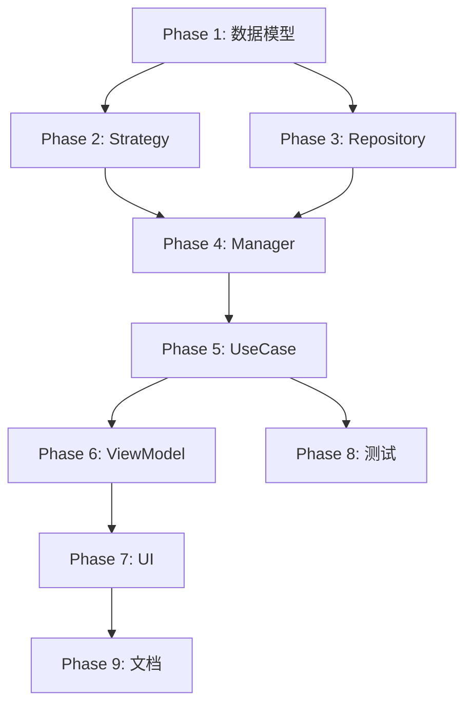

# 皇极取数法 V2 架构实现任务清单

## 项目概述

### 目标
实现完整的皇极取数法交互式计算系统，支持：
1. 基于 `HuangJiCalculationFormula` 和 `HuangJiDataCalculationFormula` 的计算流程
2. Session 状态管理，支持任意阶段回滚和持久化恢复
3. 基础数选择流程，包括去重和批量选择
4. MVVM + UseCase 架构，Strategy 仅负责计算，Manager 负责状态管理

### 核心流程
```
阶段1: 计算 YuanHuiYunShi
  ├─ 输入: 四柱八字
  └─ 输出: 元会基础数、运世基础数

阶段2: 基础数选择 (去重 + 批量选择)
  ├─ 2.1: 收集所有需要选择的 baseNumberDefinition
  ├─ 2.2: 基于 name 进行去重
  ├─ 2.3: 为每个唯一定义生成候选列表 (初刻数 ± 30*N)
  ├─ 2.4: 从 TiaoWenRepository 获取条文内容
  └─ 2.5: 用户在一个页面批量选择所有基础数

阶段3: 计算最终条文列表
  ├─ 遍历所有 CalculationGroup
  ├─ 获取用户选择的基础数
  ├─ 对每个 group 的 formulas 计算条文数
  └─ 输出: 最终条文数列表
```

### 技术要点
- **去重策略**: 基于 `BaseNumberDefinition.name` 判断唯一性
- **派生链路追踪**: 记录从原始基础数到最终选择值的完整路径
- **持久化**: 内存存储 + Repository 接口定义
- **回滚支持**: 保存每个阶段的快照，支持任意阶段回滚

---

## 任务清单

### Phase 1: 数据模型层 (Domain Models)

#### 1.1 基础数选择相关模型
- [ ] **Task 1.1.1**: 创建 `BaseNumberSelectionRecord` 类
  - 文件: `lib/domain/models/base_number_selection_record.dart`
  - 字段:
    - `baseNumberDefinitionId`: String (基于 name)
    - `name`: String
    - `derivationChain`: BaseNumberDerivationChain
    - `candidateConfig`: CandidateGenerationConfig
    - `candidates`: List<BaseNumberCandidate>
    - `selectedCandidate`: BaseNumberCandidate?
    - `status`: SelectionStatus (enum)
    - `relatedGroupIds`: List<String>
  - 方法:
    - `fromJson` / `toJson`
    - `copyWith`
    - `isCompleted` getter

- [ ] **Task 1.1.2**: 创建 `BaseNumberDerivationChain` 类
  - 文件: 同上
  - 字段:
    - `source`: DataPredefinedBaseNumber (元会或运世)
    - `derivationSteps`: List<DerivationStep>
    - `finalDefinition`: DataBaseNumberDefinition
  - 方法:
    - `getFullPath()`: String (返回完整路径描述)
    - `fromJson` / `toJson`

- [ ] **Task 1.1.3**: 创建 `DerivationStep` 类
  - 文件: 同上
  - 字段:
    - `operation`: String (例如: "+年干*1000")
    - `value`: int
    - `description`: String
  - 方法: `fromJson` / `toJson`

- [ ] **Task 1.1.4**: 创建 `CandidateGenerationConfig` 类
  - 文件: 同上
  - 字段:
    - `initialNumber`: int (初刻数)
    - `offset`: int (默认 30)
    - `count`: int (默认 10，前后各取)
    - `minValue`: int (1000)
    - `maxValue`: int (13000)
  - 方法: `fromJson` / `toJson`

- [ ] **Task 1.1.5**: 创建 `BaseNumberCandidate` 类
  - 文件: 同上
  - 字段:
    - `id`: String
    - `number`: int (条文数)
    - `offsetFromInitial`: int (相对初刻数的偏移)
    - `tiaoWenContent`: String (条文内容)
    - `isInitial`: bool (是否为初刻数)
  - 方法: `fromJson` / `toJson` / `copyWith`

- [ ] **Task 1.1.6**: 创建 `SelectionStatus` 枚举
  - 文件: 同上
  - 值: `pending`, `inProgress`, `completed`, `cancelled`

#### 1.2 Session 增强模型

- [ ] **Task 1.2.1**: 扩展 `HuangJiV2Session` 类
  - 文件: `lib/features/huang_ji_v2_session.dart`
  - 新增字段:
    - `yuanHuiYunShi`: YuanHuiYunShi (必须保存)
    - `baseNumberSelections`: Map<String, BaseNumberSelectionRecord>
    - `finalTiaoWenList`: List<TiaoWenResult>?
    - `currentPhase`: SessionPhase (enum)
    - `phaseHistory`: List<SessionSnapshot>
  - 新增方法:
    - `addSnapshot(SessionSnapshot)`: 添加快照
    - `getLatestSnapshot()`: 获取最新快照
    - `canRollback()`: bool

- [ ] **Task 1.2.2**: 创建 `SessionPhase` 枚举
  - 文件: 同上
  - 值:
    - `initialized`: 已初始化
    - `yuanHuiYunShiCalculated`: 元会运世已计算
    - `baseNumberSelectionReady`: 基础数选择准备就绪
    - `baseNumberSelected`: 基础数已选择
    - `finalCalculationComplete`: 最终计算完成

- [ ] **Task 1.2.3**: 创建 `SessionSnapshot` 类
  - 文件: 同上
  - 字段:
    - `snapshotId`: String
    - `phase`: SessionPhase
    - `timestamp`: DateTime
    - `state`: Map<String, dynamic> (该阶段的完整状态)
  - 方法: `fromJson` / `toJson`

- [ ] **Task 1.2.4**: 创建 `TiaoWenResult` 类
  - 文件: `lib/domain/models/tiao_wen_result.dart`
  - 字段:
    - `groupId`: String
    - `formulaName`: String
    - `baseNumber`: int
    - `tiaoWenNumber`: int
    - `tiaoWenContent`: String
    - `calculationDetail`: String (计算过程描述)
  - 方法: `fromJson` / `toJson`

#### 1.3 批量选择相关模型

- [ ] **Task 1.3.1**: 创建 `BaseNumberSelectionBatch` 类
  - 文件: `lib/domain/models/base_number_selection_batch.dart`
  - 字段:
    - `items`: List<BaseNumberSelectionItem>
    - `definitionToGroupsMap`: Map<String, List<String>>
  - 方法: `fromJson` / `toJson`

- [ ] **Task 1.3.2**: 创建 `BaseNumberSelectionItem` 类
  - 文件: 同上
  - 字段:
    - `definitionId`: String
    - `name`: String
    - `description`: String
    - `derivationChain`: BaseNumberDerivationChain
    - `candidates`: List<BaseNumberCandidate>
    - `relatedGroupIds`: List<String>
  - 方法: `fromJson` / `toJson`

---

### Phase 2: Strategy 层 (纯计算逻辑)

#### 2.1 皇极计算策略

- [ ] **Task 2.1.1**: 创建 `HuangJiCalculationStrategy` 抽象类
  - 文件: `lib/service/strategy/huang_ji_calculation_strategy.dart`
  - 方法:
    ```dart
    /// 计算元会运世
    YuanHuiYunShi calculateYuanHuiYunShi(EightChars eightChars);

    /// 生成基础数候选列表 (不含条文内容)
    List<BaseNumberCandidate> generateCandidates({
      required int initialNumber,
      required CandidateGenerationConfig config,
    });

    /// 计算派生基础数的数值
    int calculateDerivedBaseNumber({
      required DataBaseNumberDefinition baseDefinition,
      required YuanHuiYunShi yhys,
    });

    /// 计算最终条文数
    int calculateTiaoWenNumber({
      required int baseNumber,
      required TiaoWenFormulaData formula,
    });

    /// 构建派生链路
    BaseNumberDerivationChain buildDerivationChain({
      required DataBaseNumberDefinition definition,
      required YuanHuiYunShi yhys,
    });
    ```

- [ ] **Task 2.1.2**: 实现 `HuangJiCalculationStrategyImpl` 类
  - 文件: `lib/service/strategy/huang_ji_calculation_strategy_impl.dart`
  - 实现所有抽象方法
  - 重点:
    - `generateCandidates`: 生成 `initialNumber ± offset*N`，确保在 1000-13000 范围内
    - `buildDerivationChain`: 递归追溯到 PredefinedBaseNumber，记录每步操作

---

### Phase 3: Repository 层

#### 3.1 Session 持久化

- [ ] **Task 3.1.1**: 创建 `SessionRepository` 接口
  - 文件: `lib/repository/session_repository.dart`
  - 方法:
    ```dart
    Future<void> saveSession(HuangJiV2Session session);
    Future<HuangJiV2Session?> loadSession(String sessionId);
    Future<List<HuangJiV2Session>> getAllSessions();
    Future<void> deleteSession(String sessionId);
    Future<void> saveSnapshot(String sessionId, SessionSnapshot snapshot);
    Future<SessionSnapshot?> loadLatestSnapshot(String sessionId);
    Future<List<SessionSnapshot>> loadAllSnapshots(String sessionId);
    ```

- [ ] **Task 3.1.2**: 实现 `InMemorySessionRepository` 类
  - 文件: `lib/repository/session_repository_impl.dart`
  - 使用 `Map<String, HuangJiV2Session>` 存储
  - 使用 `Map<String, List<SessionSnapshot>>` 存储快照

#### 3.2 条文查询扩展

- [ ] **Task 3.2.1**: 扩展 `TiaoWenRepository` 接口
  - 文件: `lib/repository/tiao_wen_repository.dart`
  - 新增方法:
    ```dart
    /// 批量获取条文内容 (返回 Map<条文数, 条文内容>)
    Future<Map<int, String>> getTiaoWenContentByNumbers(List<int> numbers);

    /// 获取条文内容字符串 (单个)
    Future<String?> getTiaoWenContentByNumber(int number);
    ```

- [ ] **Task 3.2.2**: 在 `TiaoWenRepositoryImpl` 中实现新方法
  - 文件: `lib/repository/tiao_wen_repository_impl.dart`
  - 实现逻辑:
    - 调用现有的 `getByIdList` 方法
    - 提取 `content1` 字段作为条文内容

---

### Phase 4: Manager 层 (状态管理)

#### 4.1 Session Manager

- [ ] **Task 4.1.1**: 创建 `HuangJiV2SessionManager` 类
  - 文件: `lib/application/managers/huang_ji_v2_session_manager.dart`
  - 依赖:
    - `SessionRepository`
    - `HuangJiCalculationStrategy`
  - 方法:
    ```dart
    /// 创建新 session
    Future<HuangJiV2Session> createSession({
      required EightChars eightChars,
      required HuangJiCalculationFormula formula,
      String? sessionName,
    });

    /// 保存 session
    Future<void> saveSession(HuangJiV2Session session);

    /// 恢复 session
    Future<HuangJiV2Session?> restoreSession(String sessionId);

    /// 推进到下一阶段
    Future<HuangJiV2Session> advanceToPhase({
      required HuangJiV2Session session,
      required SessionPhase targetPhase,
    });

    /// 创建当前阶段快照
    SessionSnapshot createSnapshot(HuangJiV2Session session);

    /// 回滚到指定快照
    Future<HuangJiV2Session> rollbackToSnapshot({
      required HuangJiV2Session session,
      required String snapshotId,
    });

    /// 回滚到上一阶段
    Future<HuangJiV2Session> rollbackToPreviousPhase(
      HuangJiV2Session session,
    );

    /// 获取所有快照
    Future<List<SessionSnapshot>> getSnapshots(String sessionId);
    ```

- [ ] **Task 4.1.2**: 实现 `createSnapshot` 方法
  - 将当前 session 状态序列化为 JSON
  - 存储到 `SessionSnapshot.state` 字段

- [ ] **Task 4.1.3**: 实现 `rollbackToSnapshot` 方法
  - 从快照中恢复 session 状态
  - 更新 `currentPhase`

---

### Phase 5: UseCase 层 (业务编排)

#### 5.1 主要 UseCase

- [ ] **Task 5.1.1**: 创建 `HuangJiInteractiveUseCase` 类
  - 文件: `lib/application/usecases/huang_ji_interactive_use_case.dart`
  - 依赖:
    - `HuangJiV2SessionManager`
    - `HuangJiCalculationStrategy`
    - `TiaoWenRepository`
    - `HuangJiFormulaManager`
  - 方法框架:
    ```dart
    /// 步骤1: 初始化 session 并计算元会运世
    Future<HuangJiV2Session> initializeSession({
      required EightChars eightChars,
      required int formulaId,
    });

    /// 步骤2: 准备基础数选择列表 (去重 + 生成候选项)
    Future<BaseNumberSelectionBatch> prepareBaseNumberSelection(
      String sessionId,
    );

    /// 步骤3: 用户提交选择
    Future<HuangJiV2Session> submitBaseNumberSelections({
      required String sessionId,
      required Map<String, String> selections, // definitionId -> candidateId
    });

    /// 步骤4: 计算最终条文列表
    Future<List<TiaoWenResult>> calculateFinalTiaoWenList(
      String sessionId,
    );

    /// 回滚操作
    Future<HuangJiV2Session> rollbackToPhase({
      required String sessionId,
      required SessionPhase targetPhase,
    });

    /// 获取当前 session 状态
    Future<HuangJiV2Session?> getCurrentSession(String sessionId);
    ```

#### 5.2 核心逻辑实现

- [ ] **Task 5.2.1**: 实现 `initializeSession` 方法
  - 调用 `sessionManager.createSession`
  - 调用 `calculationStrategy.calculateYuanHuiYunShi`
  - 更新 session 的 `yuanHuiYunShi` 和 `currentPhase`
  - 创建快照
  - 保存 session

- [ ] **Task 5.2.2**: 实现 `prepareBaseNumberSelection` 方法 ⭐ 核心逻辑
  - 加载 session
  - 获取 formula 并转换为 DataFormula
  - 遍历所有 groups，收集需要选择的 baseNumberDefinition
  - **去重逻辑**:
    ```dart
    Map<String, BaseNumberSelectionItem> uniqueDefinitions = {};
    Map<String, List<String>> definitionToGroups = {};

    for (final group in dataFormula.groups) {
      final baseNumDef = group.baseNumberDefinition;

      // 判断是否需要用户选择
      if (!_requiresUserSelection(baseNumDef)) continue;

      // 使用 name 作为唯一 ID
      final definitionId = baseNumDef.name;

      // 记录 group 关联
      definitionToGroups
        .putIfAbsent(definitionId, () => [])
        .add(group.groupId);

      // 如果已存在，跳过
      if (uniqueDefinitions.containsKey(definitionId)) continue;

      // 构建派生链路
      final chain = calculationStrategy.buildDerivationChain(
        definition: baseNumDef,
        yhys: session.yuanHuiYunShi!,
      );

      // 生成候选列表 (不含条文内容)
      final candidates = calculationStrategy.generateCandidates(
        initialNumber: baseNumDef.number,
        config: CandidateGenerationConfig(...),
      );

      // 批量获取条文内容
      final numbers = candidates.map((c) => c.number).toList();
      final contents = await tiaoWenRepository
        .getTiaoWenContentByNumbers(numbers);

      // 合并数值和内容
      final candidatesWithContent = candidates.map((c) {
        return c.copyWith(
          tiaoWenContent: contents[c.number] ?? '条文未找到',
        );
      }).toList();

      uniqueDefinitions[definitionId] = BaseNumberSelectionItem(
        definitionId: definitionId,
        name: baseNumDef.name,
        description: baseNumDef.description,
        derivationChain: chain,
        candidates: candidatesWithContent,
        relatedGroupIds: definitionToGroups[definitionId]!,
      );
    }

    return BaseNumberSelectionBatch(
      items: uniqueDefinitions.values.toList(),
      definitionToGroupsMap: definitionToGroups,
    );
    ```

- [ ] **Task 5.2.3**: 实现 `_requiresUserSelection` 辅助方法
  - 判断 `DataBaseNumberDefinition` 是否需要用户选择
  - `DataSelectableBaseNumber`: 总是需要
  - `DataDerivedBaseNumber`: 递归检查 `baseNumberDefinition`
  - `DataPredefinedBaseNumber`: 不需要 (除非被包装在 Selectable 中)

- [ ] **Task 5.2.4**: 实现 `submitBaseNumberSelections` 方法
  - 加载 session
  - 验证所有必需的选择都已提交
  - 创建 `BaseNumberSelectionRecord` 并存储到 `session.baseNumberSelections`
  - 更新 `currentPhase` 为 `baseNumberSelected`
  - 创建快照
  - 保存 session

- [ ] **Task 5.2.5**: 实现 `calculateFinalTiaoWenList` 方法
  - 加载 session
  - 获取 formula 并转换为 DataFormula
  - 遍历所有 groups:
    ```dart
    List<TiaoWenResult> results = [];

    for (final group in dataFormula.groups) {
      // 获取该 group 的基础数
      final baseNumDef = group.baseNumberDefinition;
      final definitionId = baseNumDef.name;
      final selectionRecord = session.baseNumberSelections[definitionId];

      int baseNumber;
      if (selectionRecord != null) {
        // 用户选择的值
        baseNumber = selectionRecord.selectedCandidate!.number;
      } else {
        // 不需要选择的，直接使用计算值
        baseNumber = baseNumDef.number;
      }

      // 遍历该 group 的所有 formulas
      for (final formula in group.dataFormulas) {
        final tiaoWenNumber = calculationStrategy.calculateTiaoWenNumber(
          baseNumber: baseNumber,
          formula: formula,
        );

        final content = await tiaoWenRepository
          .getTiaoWenContentByNumber(tiaoWenNumber);

        results.add(TiaoWenResult(
          groupId: group.groupId,
          formulaName: formula.name,
          baseNumber: baseNumber,
          tiaoWenNumber: tiaoWenNumber,
          tiaoWenContent: content ?? '条文未找到',
          calculationDetail: '${baseNumber} + ${formula.description}',
        ));
      }
    }

    // 更新 session
    session = session.copyWith(
      finalTiaoWenList: results,
      currentPhase: SessionPhase.finalCalculationComplete,
    );
    await sessionManager.saveSession(session);

    return results;
    ```

- [ ] **Task 5.2.6**: 实现 `rollbackToPhase` 方法
  - 加载 session
  - 查找指定阶段的快照
  - 调用 `sessionManager.rollbackToSnapshot`
  - 返回恢复后的 session

---

### Phase 6: ViewModel 层 (MVVM)

#### 6.1 ViewModel 实现

- [ ] **Task 6.1.1**: 创建 `HuangJiInteractiveViewModel` 类
  - 文件: `lib/presentation/viewmodels/huang_ji_interactive_view_model.dart`
  - 继承: `ChangeNotifier` 或使用 Riverpod
  - 依赖: `HuangJiInteractiveUseCase`
  - 状态字段:
    ```dart
    HuangJiV2Session? currentSession;
    BaseNumberSelectionBatch? selectionBatch;
    List<TiaoWenResult>? finalResults;
    bool isLoading;
    String? errorMessage;
    ```
  - 方法:
    ```dart
    Future<void> initialize(EightChars eightChars, int formulaId);
    Future<void> loadSelectionOptions();
    Future<void> submitSelections(Map<String, String> selections);
    Future<void> calculateFinalResults();
    Future<void> rollback(SessionPhase targetPhase);
    bool canRollback();
    ```

- [ ] **Task 6.1.2**: 实现各个方法，调用 UseCase

---

### Phase 7: UI 层

#### 7.1 基础数批量选择页面

- [ ] **Task 7.1.1**: 创建 `BaseNumberBatchSelectionPage` 页面
  - 文件: `lib/presentation/pages/base_number_batch_selection_page.dart`
  - 功能:
    - 展示 `BaseNumberSelectionBatch.items` 列表
    - 每个 item 显示:
      - 名称和描述
      - 派生链路路径
      - 候选列表 (滚动选择器或下拉框)
      - 条文内容预览
    - 底部按钮: "提交选择" / "取消"

- [ ] **Task 7.1.2**: 创建 `BaseNumberSelectionItemWidget` 组件
  - 文件: `lib/presentation/widgets/base_number_selection_item_widget.dart`
  - 显示单个选择项
  - 支持候选项切换
  - 显示相关 groupIds

- [ ] **Task 7.1.3**: 创建 `CandidateListWidget` 组件
  - 文件: `lib/presentation/widgets/candidate_list_widget.dart`
  - 横向滚动的候选项列表
  - 高亮初刻数
  - 显示偏移量 (+30, -60 等)

#### 7.2 流程主页面

- [ ] **Task 7.2.1**: 创建或修改 `HuangJiInteractivePage` 页面
  - 文件: `lib/presentation/pages/huang_ji_interactive_page.dart`
  - 阶段指示器 (步骤条)
  - 根据 `currentPhase` 显示不同内容:
    - `yuanHuiYunShiCalculated`: 显示元会运世结果，按钮 "开始选择基础数"
    - `baseNumberSelectionReady`: 跳转到批量选择页面
    - `baseNumberSelected`: 显示已选择的基础数，按钮 "计算最终条文"
    - `finalCalculationComplete`: 显示条文列表

- [ ] **Task 7.2.2**: 添加回滚按钮和逻辑
  - 在页面顶部添加 "回滚" 按钮
  - 弹出对话框选择目标阶段
  - 调用 `viewModel.rollback(targetPhase)`

---

### Phase 8: 测试

#### 8.1 单元测试

- [ ] **Task 8.1.1**: Strategy 层测试
  - 文件: `test/service/strategy/huang_ji_calculation_strategy_test.dart`
  - 测试:
    - `generateCandidates`: 验证生成的候选数在范围内
    - `buildDerivationChain`: 验证链路追踪正确
    - `calculateDerivedBaseNumber`: 验证派生计算

- [ ] **Task 8.1.2**: Repository 层测试
  - 文件: `test/repository/session_repository_test.dart`
  - 测试: 保存、加载、删除、快照操作

- [ ] **Task 8.1.3**: UseCase 层测试
  - 文件: `test/application/usecases/huang_ji_interactive_use_case_test.dart`
  - 测试完整流程
  - 重点测试去重逻辑

#### 8.2 集成测试

- [ ] **Task 8.2.1**: 完整流程测试
  - 文件: `test/integration/huang_ji_full_flow_test.dart`
  - 模拟用户完整操作流程

---

### Phase 9: 文档

- [ ] **Task 9.1**: 编写架构文档
  - 文件: `docs/claude/huang_ji/architecture.md`
  - 说明各层职责和数据流

- [ ] **Task 9.2**: 编写 API 文档
  - 文件: `docs/claude/huang_ji/api_reference.md`
  - 列出所有公共 API

- [ ] **Task 9.3**: 编写使用指南
  - 文件: `docs/claude/huang_ji/user_guide.md`
  - 说明如何使用该系统

---

## 优先级排序

### P0 (最高优先级 - 核心功能)
1. Phase 1: 数据模型层 (Task 1.1.x, 1.2.x, 1.3.x)
2. Phase 2: Strategy 层 (Task 2.1.x)
3. Phase 3: Repository 层 (Task 3.1.x, 3.2.x)
4. Phase 4: Manager 层 (Task 4.1.x)
5. Phase 5: UseCase 层 (Task 5.1.x, 5.2.x)

### P1 (次优先级 - 用户交互)
6. Phase 6: ViewModel 层 (Task 6.1.x)
7. Phase 7: UI 层 (Task 7.1.x, 7.2.x)

### P2 (可延后 - 质量保证)
8. Phase 8: 测试 (Task 8.1.x, 8.2.x)
9. Phase 9: 文档 (Task 9.x)

---

## 预估工作量

| Phase | 任务数 | 预估时间 (小时) | 说明 |
|-------|--------|-----------------|------|
| Phase 1 | 14 | 6-8 | 数据模型定义，较机械 |
| Phase 2 | 2 | 4-6 | 核心计算逻辑，需要仔细实现 |
| Phase 3 | 4 | 2-3 | Repository 相对简单 |
| Phase 4 | 3 | 4-5 | 状态管理，需要处理序列化 |
| Phase 5 | 6 | 8-10 | 业务编排，去重逻辑复杂 |
| Phase 6 | 2 | 2-3 | ViewModel 封装 |
| Phase 7 | 5 | 6-8 | UI 实现 |
| Phase 8 | 3 | 4-6 | 测试编写 |
| Phase 9 | 3 | 2-3 | 文档编写 |
| **总计** | **42** | **38-52** | 约 1-1.5 周 |

---

## 关键依赖关系



---

## 里程碑

- **Milestone 1** (Day 3): Phase 1-3 完成，核心数据和存储就绪
- **Milestone 2** (Day 5): Phase 4-5 完成，业务逻辑可运行
- **Milestone 3** (Day 7): Phase 6-7 完成，UI 可交互
- **Milestone 4** (Day 9): Phase 8-9 完成，系统稳定可交付

---

## 注意事项

1. **去重关键**: 确保基于 `name` 的去重逻辑正确，避免重复选择
2. **链路追踪**: `buildDerivationChain` 必须递归追溯到根源，记录完整路径
3. **快照设计**: 快照的 `state` 字段需要包含足够信息以恢复到该阶段
4. **条文查询**: 注意条文数可能不存在，需要处理 null 情况
5. **JSON 序列化**: 所有 Model 都需要 `fromJson` / `toJson`，建议使用 `json_serializable`

---

## 开发环境

- Flutter SDK: >=3.0.0
- Dart SDK: >=3.0.0
- 依赖包:
  - `json_annotation`
  - `json_serializable`
  - `provider` 或 `riverpod` (状态管理)
  - `flutter_test` (测试)

---

**文档版本**: v1.0
**创建时间**: 2025-01-XX
**最后更新**: 2025-01-XX
**维护者**: Claude Code Assistant
