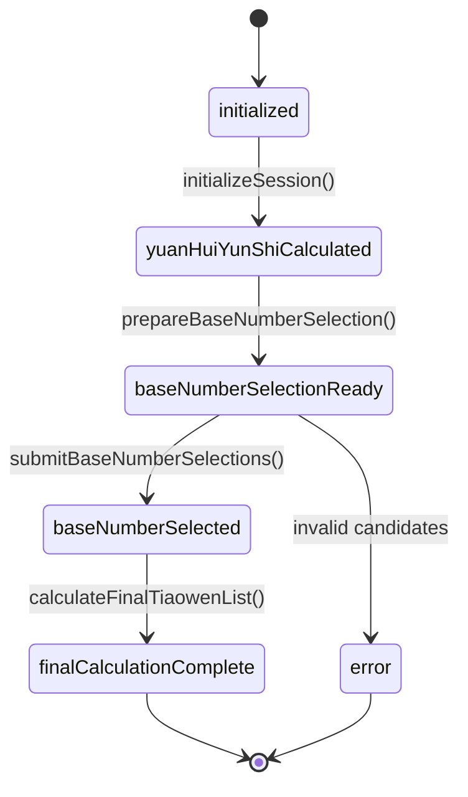
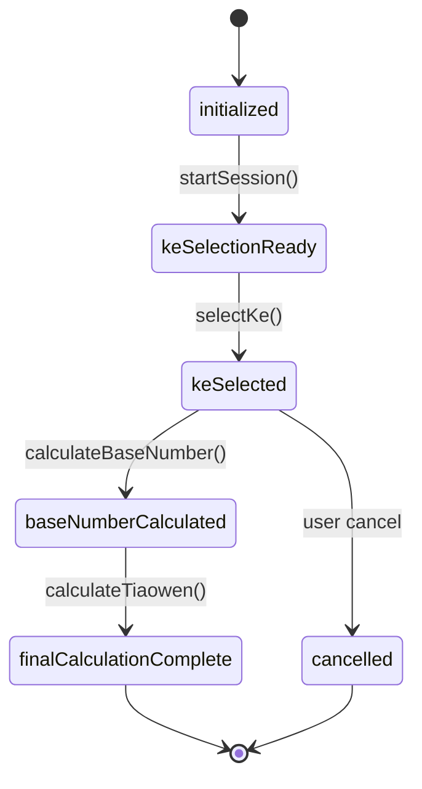
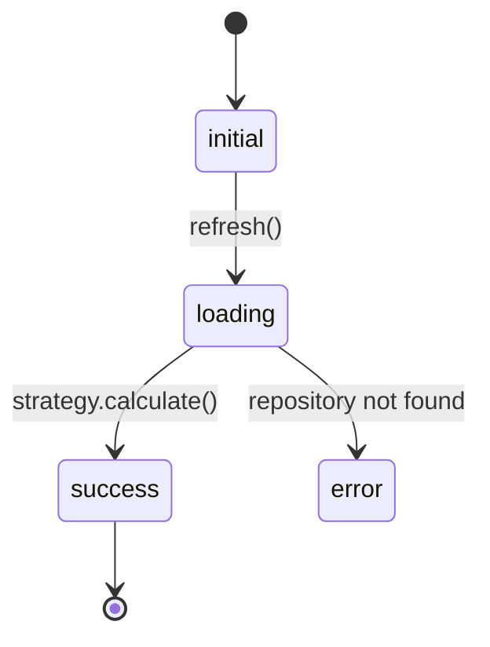
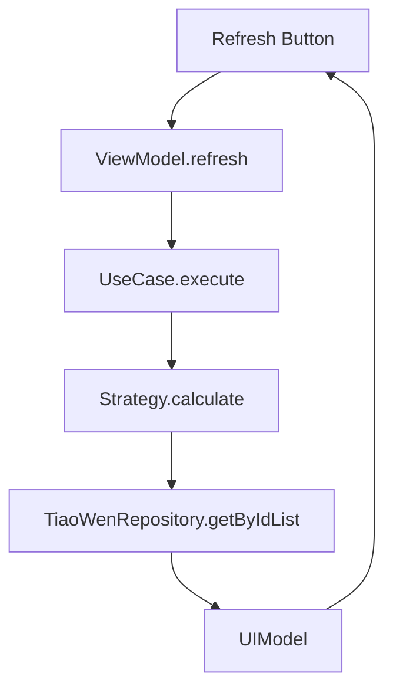

# 代码审阅与架构总览

说明：本文件对项目中策略演示入口、四门法V2与八卦滚法、皇极取数法V2、六亲考刻取数法/八刻秘数考刻法、考订六亲的核心代码结构、调用链与数据流进行结构化审阅，便于后续维护与扩展。

1. Strategy 演示入口页面 StrategyDemoPage
- 文件：presentation/pages/strategy_demo_page.dart
- 职责：统一演示与对比多种策略的计算结果；集中初始化各 ViewModel；提供“刷新当前/刷新全部”等交互。
- Tab 与 ViewModel 映射（12个）：
  - 日干支卦 DayGanZhiGuaViewModel（usecases/day_gan_zhi_gua_tiao_wen_list_use_case.dart）
  - 四柱天干 FourZhuTianGanViewModel（usecases/four_zhu_tian_gan_tiao_wen_list_use_case.dart）
  - 太玄四柱 TaiXuanFourZhuViewModel（usecases/tai_xuan_four_zhu_tiao_wen_list_use_case.dart；presentation/widgets/tai_xuan_dual_method_card.dart）
  - 八卦加则 BaGuaJiaZeViewModel（usecases/ba_gua_jia_ze_tiao_wen_list_use_case.dart）
  - 元堂 YuanTangViewModel（usecases/yuan_tang_tiao_wen_list_use_case.dart；presentation/models/yuan_tang_ui_model.dart）
  - 先后天加则 XianHoutianJiaZeViewModel（usecases/xian_houtian_jia_ze_tiao_wen_list_use_case.dart）
  - 六爻干支和 LiuYaoGanZhiHeViewModel（usecases/liu_yao_gan_zhi_he_tiao_wen_list_use_case.dart）
  - 卦爻干支和 GuaYaoGanZhiHeViewModel（usecases/gua_yao_gan_zhi_he_tiao_wen_list_use_case.dart）
  - 先后天取数 XianHoutianQuShuViewModel（usecases/xian_houtian_qu_shu_tiao_wen_list_use_case.dart）
  - 前后卦 QianHouGuaViewModel（usecases/qian_hou_gua_tiao_wen_list_use_case.dart）
  - 卦中 GuaZhongViewModel（usecases/gua_zhong_tiao_wen_list_use_case.dart）
  - 太玄四柱交互 TaiXuanFourZhuInteractiveViewModel（usecases/tai_xuan_four_zhu_interactive_use_case.dart）
- 依赖注入：infrastructure/di/strategy_providers.dart 提供全部 Strategy/UseCase/ViewModel 的 DI。
- 调用链通用模式：UI Widget -> ViewModel.refresh()/calculate() -> UseCase.execute() -> Strategy.calculate() -> Repository.getByIdList() -> UIModel构建 -> Widget渲染。

2. 四门法V2 与 八卦滚法
- 页面：presentation/pages/four_doors_and_gun_fa_page.dart（两个 Tab，四门法V2/八卦滚法）
- ViewModel：
  - SiMenFaViewModel（presentation/viewmodels/si_men_fa_view_model.dart）
    - UseCase：si_men_fa_tiao_wen_list_use_case.dart
    - Strategy/Calculator：service/strategy/si_men_fa_strategy.dart（SiMenFaStrategy、SiMenFaCalculator，依赖 MultiGuaCalculatorBase 与 TiaoWenNumberCalculator）
    - Domain 模型：domain/models/si_men_fa_base_number_model.dart
    - UI 模型：presentation/models/si_men_fa_ui_model.dart
  - BaGuaGunViewModel（presentation/viewmodels/ba_gua_gun_view_model.dart）
    - UseCase：ba_gua_gun_tiao_wen_list_use_case.dart
    - Strategy：service/strategy/ba_gua_gun_strategy.dart
    - Domain 模型：domain/models/ba_gua_gun_base_number_model.dart
    - UI 模型：presentation/models/ba_gua_gun_ui_model.dart（复用 SiMenFaUIModel 中的 GuaInfoUIModel、GuaThreeNumbersUIModel）
- 数据流（以四门法V2为例）：
  - 输入：EightChars + Gender + YuanYunOrder
  - Strategy 生成 fourGuaList、basic/variation 序列 -> 计算秘数/先天数 -> Final 条文列表 + SourceInfo。
  - UseCase 批量查询条文 Repository.getByIdList -> 封装 BaseNumberTiaoWenListModel。
  - ViewModel 合成 UIModel，提供统计与展示字段（basicGua、variationBase、fourGuaSummary、tiaoWenTotalCount）。
- 错误处理：Strategy 返回 BaseNumberModelResult.error，UseCase抛出异常，ViewModel设置 isLoading/error 并在页面上展示。

3. 皇极取数法 V2 新架构
- 核心文件：features/huang_ji/huang_ji_v2_session_models.dart、huang_ji_formula_v2.dart、huang_ji_v2_use_case.dart
- 会话/状态机：
  - SessionPhase：initialized -> yuanHuiYunShiCalculated -> baseNumberSelectionReady -> baseNumberSelected -> finalCalculationComplete
  - SessionStatus：notStarted/inProgress/waitingForSelection/paused/completed/cancelled/error
  - SessionSnapshot：记录阶段性快照，支持 rollbackToPhase。
- Formula/Converter：
  - HuangJiCalculationFormula（分组 CalculationGroup，围绕 BaseNumberDefinition）
  - BaseNumberDefinition：PredefinedBaseNumber、DerivedBaseNumber、SelectableBaseNumber（V2架构全部需用户选择）；CalculationPart：SingleNumberPart/CompositeNumberPart。
  - 多态 JSON 转换器，支持序列化持久化。
- UseCase：HuangJiV2UseCase
  - initializeSession：创建会话并计算 YuanHuiYunShi。
  - prepareBaseNumberSelection：收集唯一 BaseNumberDefinition，构建派生链，生成候选与条文内容，产出 BaseNumberSelectionRecord。
  - submitBaseNumberSelections：校验/更新用户选择。
  - calculateFinalTiaoWenList：遍历公式，基于选择计算条文并查询内容，生成 TiaoWenResult。
  - rollbackToPhase：通过 SessionManager 回滚到历史快照。
- 依赖：HuangJiSessionManager、HuangJiV2CalculationStrategy、TiaoWenRepository。

4. 六亲考刻取数法 与 八刻秘数考刻法（考刻）
- 交互页面：features/kao_ke/kao_ke_interactive_page.dart
  - 组件：KeSelectionTable（12时辰×8刻）、DouJiaYiSelectionTable（斗甲乙宫四支×1-5）、MethodSelector、GuaDisplay、FinalResultDisplay、TiaoWenDetailDialog。
- ViewModel：features/kao_ke/kao_ke_view_model.dart
  - 会话模型：features/kao_ke/kao_ke_session_models.dart
    - Phase：initialized -> keSelectionReady -> keSelected -> baseNumberCalculated -> finalCalculationComplete
    - Status：notStarted/inProgress/waitingForSelection/completed/cancelled/error
    - 选择记录：KeSelectionRecord（八刻）、DouJiaYiSelectionRecord（斗甲乙宫），最终 Map<Method, List<TiaoWenResult>>。
  - UseCase：features/kao_ke/kao_ke_use_case.dart（编排 SessionManager 与 Strategy，读取常量 KaoKeConstants）
  - Strategy：features/kao_ke/kao_ke_calculation_strategy_impl.dart
    - 计算步骤：由 baseNumber 计算卦（gua_calculation_helper.dart），按方法计算条文：
      - 八卦加则（service/strategy/ba_gua_jia_ze_strategy.dart）
      - 爻干支和数法（service/strategy/liu_yao_gan_zhi_he_strategy.dart，含 domain/models/gua_yao_gan_zhi_he_base_number_model.dart）
    - 查询条文内容：TiaoWenRepository
- “六亲考刻取数法”模块：features/liuqinkaoke/**
  - ViewModel：liuqinkaoke_view_model.dart
  - UseCase：liuqinkaoke_use_case.dart（协调 SessionManager）
  - SessionManager：liuqinkaoke_session_manager.dart（生成候选、完成选择、回滚、恢复最近会话；依赖 TiaoWenListCalculationConfig、middlePalaceFiveStrategy 等）
  - Strategy：liuqinkaoke_calculation_strategy.dart（默认实现 liuqinkaoke_default_strategy.dart）
- 数据流：用户选择八刻/斗甲乙宫刻 -> 计算卦象 -> 按所选方法计算条文 -> 查询条文内容 -> 整理结果展示。

5. 考订六亲
- 页面：features/kao_ding_liu_qin/pages/kao_ding_liu_qin_page.dart
- ViewModel：presentation/viewmodels/kao_ding_liu_qin_view_model.dart（状态：initial/loading/success/error；管理所有六亲类型结果、流度表条目、用户选择的条文、化卦与64卦结果、夫妻任次）
- UseCase：features/kao_ding_liu_qin/usecases/kao_ding_liu_qin_use_case.dart
  - 计算：KaoDingLiuQinStrategy.calculate -> 生成 KaoDingLiuQinResult -> 创建 SessionState 并保存到 SessionManager 历史
- Strategy：features/kao_ding_liu_qin/services/kao_ding_liu_qin_strategy.dart
  - 流程：起卦（features/six_yao_gua/pure_six_yao_gua.dart）-> 纳甲与六亲（NaJiaLiuQinHelper）-> 定位目标爻（父母/妻财等）-> 查流度表（repositories/liu_du_table_repository.dart）-> 生成结果（含所有候选条文与高亮条目）。
- 数据流：输入八字与选择柱/六亲类型/夫妻任次 -> 生成起卦与纳甲 -> 选中目标爻 -> 展示对应流度表并列出条文编号 -> 查询条文内容供 UI 展示。

6. 依赖与错误处理
- DI：infrastructure/di/strategy_providers.dart 统一提供 Strategy、UseCase、ViewModel、Repository、配置等。
- Repository：TiaoWenRepository/TiaoWenRepositoryImpl 负责条文内容查询；LiuDuTableRepository 负责考订六亲流度表。
- 错误处理：
  - Strategy 层返回 Result.error 或抛出异常；UseCase 捕获/再抛；ViewModel 通过 isLoading/error 状态反馈到 UI；页面统一使用 LoadingWidget/ErrorWidget 展示。
- 可扩展性：
  - 新策略接入：实现 BaseCalculationStrategy 或自定义 Strategy + UseCase + ViewModel + UIModel，注册 DI，接入演示页或交互页。
  - 会话化功能：参考皇极V2与考刻两套 SessionManager/SessionSnapshot 实现，支持阶段化推进、回滚与持久化。

7. 文件与类索引（非完整，重点）
- StrategyDemoPage：presentation/pages/strategy_demo_page.dart
- 四门法V2：service/strategy/si_men_fa_strategy.dart、usecases/si_men_fa_tiao_wen_list_use_case.dart、presentation/viewmodels/si_men_fa_view_model.dart、presentation/models/si_men_fa_ui_model.dart
- 八卦滚法：service/strategy/ba_gua_gun_strategy.dart、usecases/ba_gua_gun_tiao_wen_list_use_case.dart、presentation/viewmodels/ba_gua_gun_view_model.dart、presentation/models/ba_gua_gun_ui_model.dart
- 太玄四柱：presentation/widgets/tai_xuan_dual_method_card.dart、presentation/viewmodels/tai_xuan_four_zhu_view_model.dart
- 皇极V2：features/huang_ji/huang_ji_v2_session_models.dart、features/huang_ji/huang_ji_formula_v2.dart、features/huang_ji/huang_ji_v2_use_case.dart
- 考刻：features/kao_ke/kao_ke_interactive_page.dart、features/kao_ke/kao_ke_view_model.dart、features/kao_ke/kao_ke_use_case.dart、features/kao_ke/kao_ke_calculation_strategy_impl.dart、features/kao_ke/kao_ke_session_models.dart
- 六亲考刻取数法：features/liuqinkaoke/viewmodels/liuqinkaoke_view_model.dart、features/liuqinkaoke/usecase/liuqinkaoke_use_case.dart、features/liuqinkaoke/usecase/liuqinkaoke_session_manager.dart、features/liuqinkaoke/strategy/liuqinkaoke_calculation_strategy.dart
- 考订六亲：features/kao_ding_liu_qin/pages/kao_ding_liu_qin_page.dart、presentation/viewmodels/kao_ding_liu_qin_view_model.dart、features/kao_ding_liu_qin/usecases/kao_ding_liu_qin_use_case.dart、features/kao_ding_liu_qin/services/kao_ding_liu_qin_strategy.dart、features/kao_ding_liu_qin/repositories/liu_du_table_repository.dart

结论：项目以“Strategy -> UseCase -> ViewModel -> UIModel/Widget”的分层为主线，配合 Session 化与 DI 体系，形成清晰的调用链与数据流。新增与调整策略时，遵循该模式即可快速集成与演示。

---

补充：算法公式、示例、状态图与测试建议

A. 四门法V2算法公式与示例
- 秘数 calculateSecretNumbers（utils/tiao_wen_number_calculator.dart）
  - 将每个卦的上卦配天干、下卦配地支（guaTianganMapper, guaDizhiMapper），年干为阳取第一个，为阴取第二个。
  - 映射太玄数：gan→taiXuanGanNumberMapper（甲/己=9，乙/庚=8，丙/辛=7，丁/壬=6，戊/癸=5），zhi→taiXuanZhiNumberMapper（子9、丑8、寅7、卯6、辰5、巳4、午9、未8、申7、酉6、戌5、亥4）。
  - 拼接为两位数：阳年 secret = ganTaiXuan×10 + zhiTaiXuan；阴年 secret = zhiTaiXuan×10 + ganTaiXuan。
  - 示例（DevConstant.dev_usa：乙巳年、甲申月、戊寅日、庚申时）：
    - 年：乙(8)巳(4)，阴年→48
    - 月：甲(9)申(7)，阳柱→97
    - 日：戊(5)寅(7)，阳柱→57
    - 时：庚(8)申(7)，阳柱→87
    - 秘数列表：[48, 97, 57, 87]
- 先天数 calculateXiantianNumbers
  - 对四卦逐个取上/下卦的先天数（xianTianGuaNumberMapper：乾1、兑2、离3、震4、巽5、坎6、艮7、坤8），组合为两位数：xiantian = upper×10 + lower。
  - 四卦生成规则（service/strategy/si_men_fa_strategy.dart）：第一卦=基本卦的互卦；第二卦=第一卦变爻后的错卦；第三卦=第一卦互卦；第四卦=第二卦互卦。基础卦与变爻基数由 MultiGuaCalculatorBase 按奇偶分配与 mod8 规则得到。
- 最终条文 calculateFinalTiaowen
  - 展开秘数：对每个 secret 生成列表 [secret×19−7, secret×37−7, secret×53−7, secret×79−7, secret×103−7, secret×237−7]。
    - 例：secret=97 → [1836, 3582, 5134, 7656, 9984, 22982]
  - 组合公式：each = xiantian×47 + secretTiaowen。
  - 归一范围：若 each<1000 → each+12000；若 each>13000 → each−12000（若仍>13000，再减一次）。
  - 产出：所有四个 xiantian 与所有展开秘数的笛卡尔积，形成最终条文列表；并为每条文记录 sourceGua、secret/xiantian 来源（TiaoWenSourceInfo）。

B. 八卦滚法算法公式与流程
- 卦生成（service/strategy/ba_gua_gun_strategy.dart）
  - 前四卦：由 MultiGuaCalculatorBase 依据 TaiXuan 数配置生成。
  - 后四卦：
    1) 第五卦：第四卦变爻后上下交换；
    2) 第六卦：第五卦互卦；
    3) 第七卦：第六卦错卦；
    4) 第八卦：第七卦变爻后上下交换。
- 三基数（utils/tiao_wen_number_calculator.dart#getGuaThreeNumbers）
  - a=先天八卦顺序数：upper(先天)×10 + lower(先天)
  - b=先天洛书数：upper(先天洛书)×10 + lower(先天洛书)
  - c=后天洛书数：upper(后天洛书)×10 + lower(后天洛书)
- 每卦条文六式（calculateGuaTiaowenList）：
  - [a×100+b, a×100+c, b×100+a, b×100+c, c×100+a, c×100+b]
- 总条文：八卦×六式，共48条；UseCase 汇总并查询内容。

C. 先后天卦取数法（重构版）要点
- 先天基础数=四位拼接：上(千位)、下(百位)、互上(十位)、互下(个位)，数值来自 xianTianGuaNumberMapper。
- 后天基础数=四位拼接：同上，数值来自 houtianGuaNumberMapper。
- （可选）六爻纳甲：对两卦各六爻计算“干支太玄数之和”，过滤和=10并汇总上下卦和，形成 baseNumber=upperSum×100 + lowerSum。
- 条文扩展：±48×{2,4,8,16} 方式扩展先/后天基础数各得8条。

D. 页面/ViewModel 状态转换图（Mermaid）
- 皇极取数法 V2

- 六亲考刻取数法（含八刻秘数考刻法）

- 考订六亲

- StrategyDemoPage（典型交互流）


E. 测试建议与边界用例清单
- 通用
  - Repository 返回空/缺失字段：UI 显示“无内容”且不崩溃；UseCase 应捕获并返回意义明确的错误信息。
  - 条文编号范围归一：验证 <1000 与 >13000 的校正逻辑，覆盖两个连续减法的路径。
  - 去重策略：多源条文合并后去重，保留来源信息。
- 四门法V2
  - isYangYear 分支覆盖：阴年与阳年秘数拼接顺序正确。
  - 先天数映射正确性：覆盖八卦所有映射（乾1…坤8）；互卦/错卦生成符合配置。
  - 秘数展开常数集合：[19,37,53,79,103,237] 完整覆盖；边界 secret=40/99。
  - 归一范围与笛卡尔积大小：四个先天数 × 24 个秘数展开（4×(6×4)）的总量正确。
- 八卦滚法
  - 后四卦生成序列正确性（5~8卦规则）；变爻基数对上下交换的影响。
  - 三基数 a/b/c 的映射与组合；每卦六式生成，48条总量与去重。
  - 异常：variationBase 越界、变爻后无效卦时的保护。
- 先后天卦取数法
  - 四位拼接公式正确；（可选）六爻纳甲和数=10过滤逻辑正确。
  - 扩展 ±48×{2,4,8,16} 的边界：结果落在合法范围，重复项处理。
- 皇极V2
  - BaseNumberDefinition 选择冲突：同一派生链上的互斥项选择时抛出并保持在 baseNumberSelectionReady。
  - rollbackToPhase 行为：快照存在/不存在；跨阶段回滚后重新计算的一致性。
  - 序列化/反序列化：公式 JSON 的多态结构读写完整性。
- 六亲考刻
  - 八刻选择不完整/重复：保持 waitingForSelection；重复选择去重提示。
  - 斗甲乙宫索引越界：抛出明晰错误；候选集冲突时保留两套结果并标注来源。
  - 条文查询为空：提示“该刻无条文内容”；UI 不崩溃。
- 考订六亲
  - 目标爻识别：夫妻任次、六亲类型组合的覆盖；未找到流度表项时提示。
  - 起卦/纳甲：特例（空亡、六冲）下的稳定性；索引越界保护。

F. 基准数据与示例输入
- 推荐使用 common/lib/dev_constant.dart 的 DevConstant.dev_usa 作为基准数据：
  - 八字：乙巳年、甲申月、戊寅日、庚申时
  - 时区：America/Los_Angeles，是否夏令时由 TZ 判断
  - 可用于四门法秘数示例、八卦滚法流程演示与先后天卦取数的状态验证

如需，我可以继续补充：
- 针对每一策略的完整数值演算示例（含四卦具体取值与条文编号列表）
- 将上述状态图另存为单独文档或嵌入到相关页面 README
- 为各 UseCase/Strategy 添加测试清单（test/ 路径）与基准断言模板

G. 八卦加则取数法（策略）公式补充
- 基础公式（两法通用）：baseNumber = upperHoutian × 1000 + yaoSum − lowerHoutian
  - upperHoutian、lowerHoutian 为上/下卦的后天数
  - yaoSum 为六爻配支后的数字总和（见两种装配方法）
- 爻序法
  - 阳爻依次配：子、寅、辰、午、申、戌；阴爻依次配：丑、卯、巳、未、酉、亥
  - 从下到上为六爻依次装配地支，查表求和得到 yaoSum
  - 公式演示：upperNum000 + yaoSum − lowerNum = baseNumber
- 纳甲法
  - 下卦三爻（初、二、三）用内卦纳支；上卦三爻（四、五、上）用外卦纳支
  - 查表累加地支数字为 yaoSum
  - 公式同上
- 结果产出：每柱分别计算两法，形成两条基础数；默认不做额外“条文展开”，以原始计算结果为准

H. 四柱天干取数法（完整示例）
- 映射规则：天干→甲1、乙6、丙2、丁7、戊3、己8、庚4、辛9、壬5、癸0
- 基数拼接（顺序：月、日、时、年）：base = month×1000 + day×100 + time×10 + year
- 示例（DevConstant.dev_usa：乙巳年、甲申月、戊寅日、庚申时）
  - 月=甲→1，日=戊→3，时=庚→4，年=乙→6
  - base = 1×1000 + 3×100 + 4×10 + 6 = 1346
- 条文展开
  - 简化：[0, 96, 192, 288] → [1346, 1442, 1538, 1634]
  - 标准：[0, 96, 192, 288, 384, 480, 576, 672] → [1346, 1442, 1538, 1634, 1730, 1826, 1922, 2018]
  - 扩展：[0, 96, 192, 288, 384, 480, 576, 672, 768, 864, 960] → [1346, 1442, 1538, 1634, 1730, 1826, 1922, 2018, 2114, 2210, 2306]

I. 日柱变卦取数法（示例模板）
- 基数构成：四位数拼接 = baseUpperHoutian(千位) + baseLowerHoutian(百位) + interUpperXiantian(十位) + interLowerXiantian(个位)
  - baseUpperHoutian/baseLowerHoutian：以日柱的地支为上卦、天干为下卦，取后天数
  - interUpperXiantian/interLowerXiantian：以上述本卦的互卦为准，取先天数
- 条文展开配置
  - 标准：base ± [0, 1000]
  - 简化：base ± [0]
  - 扩展：base ± [0, 500, 1000, 2000]
- 示例使用方法：
  1) 先据“日柱”确定本卦（Gan→下、Zhi→上），查后天数得千/百位
  2) 取本卦互卦，查先天数得十/个位
  3) 合成 base，按所选配置展开条文列表

J. 先后天八卦加则法（示例模板）
- 先天/后天基数：分别用 JiaZe 规则求得（TiaowenCalculator.getTiaowenNumberByJiaZe）
- 展开策略：
  - 先天：base + [0, +96, +192, +288, +384]
  - 后天：base + [0, −96, −192, −288, −384]
- 示例（演示用）：若先天基数=3146 → [3146, 3242, 3338, 3434, 3530]；若后天基数=2754 → [2754, 2658, 2562, 2466, 2370]

K. 元堂卦取数法（公式与扩展）
- 生成：依据 EightChars + 性别 + 三元 + 出生后支 + 月令类型 + 历法类型 得到 TianDiGua
- 取数：
  - JiaZe（先天/后天）：TiaowenCalculator.getTiaowenNumberByJiaZe
  - NaJia太玄（先天/后天）：TiaowenCalculator.getTiaowenNumberByTaixuan（六爻干支太玄求和，过滤和=10）
  - 本互基数（先天/后天）：四位拼接=本卦上(千) + 本卦下(百) + 互卦上(十) + 互卦下(个)
  - 化卦列表（先天/后天）：在“本互基数”上按 ±48×{2,4,8,16} 扩展，形成 8 条候选
- 默认页面展开：customList=[0, 96, 192, 288, 384]（在所选基数上加偏移）

L. 测试样例断言模板（Dart）
- 四柱天干取数法
```dart
import 'package:flutter_test/flutter_test.dart';
// import 实际项目中的 Strategy/Params/Config/DevConstant 等

void main() {
  test('四柱天干（DevConstant.dev_usa）基数与标准展开', () async {
    final strategy = FourZhuTianGanStrategy();
    final params = FourZhuTianGanCalculationParams(
      eightChars: DevConstant.dev_usa.eightChars,
      config: GenericTiaoWenCalculationConfig.fourZhuTianGanStandard(),
    );
    final result = await strategy.calculate(params);
    expect(result.isSuccess, isTrue, reason: result.errorMessage ?? '');

    final model = result.models.first;
    expect(model.baseNumber, 1346);
    expect(
      model.tiaoWenList.map((e) => e.number).toList(),
      [1346, 1442, 1538, 1634, 1730, 1826, 1922, 2018],
    );
  });
}
```
- 先后天八卦加则法（示例）
```dart
import 'package:flutter_test/flutter_test.dart';

void main() {
  test('先后天加则：先天增、后天减', () async {
    final strategy = XianHoutianJiaZeStrategy();
    final params = XianHoutianJiaZeCalculationParams(
      eightChars: DevConstant.dev_usa.eightChars,
      config: XianHoutianJiaZeStrategy.defaultTiaoWenCalculationConfig,
    );
    final result = await strategy.calculate(params);
    expect(result.isSuccess, isTrue, reason: result.errorMessage ?? '');

    final xtModel = result.models.firstWhere((m) => m.name.contains('先天'));
    final htModel = result.models.firstWhere((m) => m.name.contains('后天'));

    // 断言偏移集合正确（不校验具体基数）
    expect(xtModel.tiaoWenOffsets, [0, 96, 192, 288, 384]);
    expect(htModel.tiaoWenOffsets, [0, -96, -192, -288, -384]);
  });
}
```
- 日柱变卦取数法（标准配置）
```dart
import 'package:flutter_test/flutter_test.dart';

void main() {
  test('日柱变卦：标准配置偏移', () async {
    final strategy = DayGanZhiGuaStrategy();
    final params = DayGanZhiGuaCalculationParams(
      eightChars: DevConstant.dev_usa.eightChars,
      config: DayGanZhiGuaStrategy.standardConfig(),
    );
    final result = await strategy.calculate(params);
    expect(result.isSuccess, isTrue, reason: result.errorMessage ?? '');
    final model = result.models.first;
    expect(model.tiaoWenOffsets, [0, 1000]);
  });
}
```