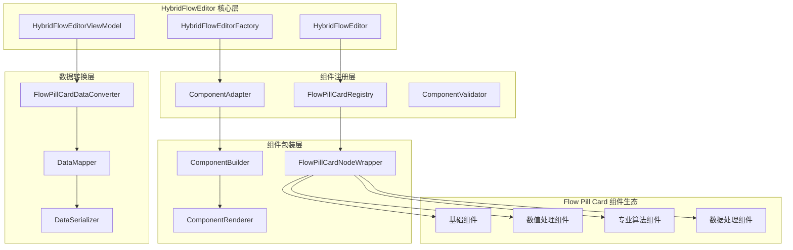
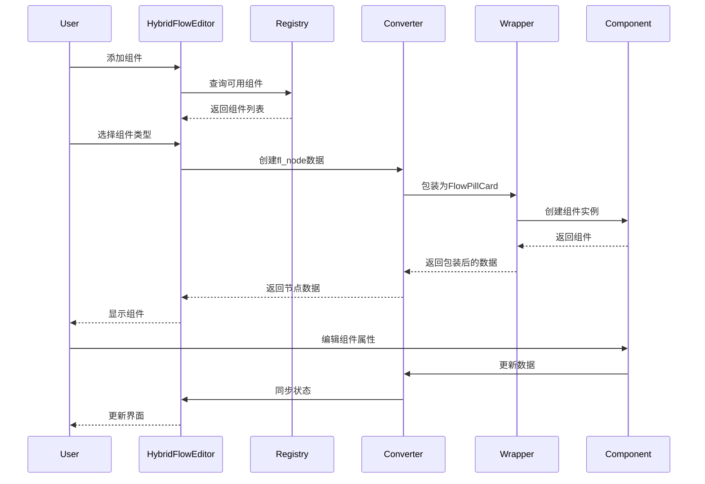
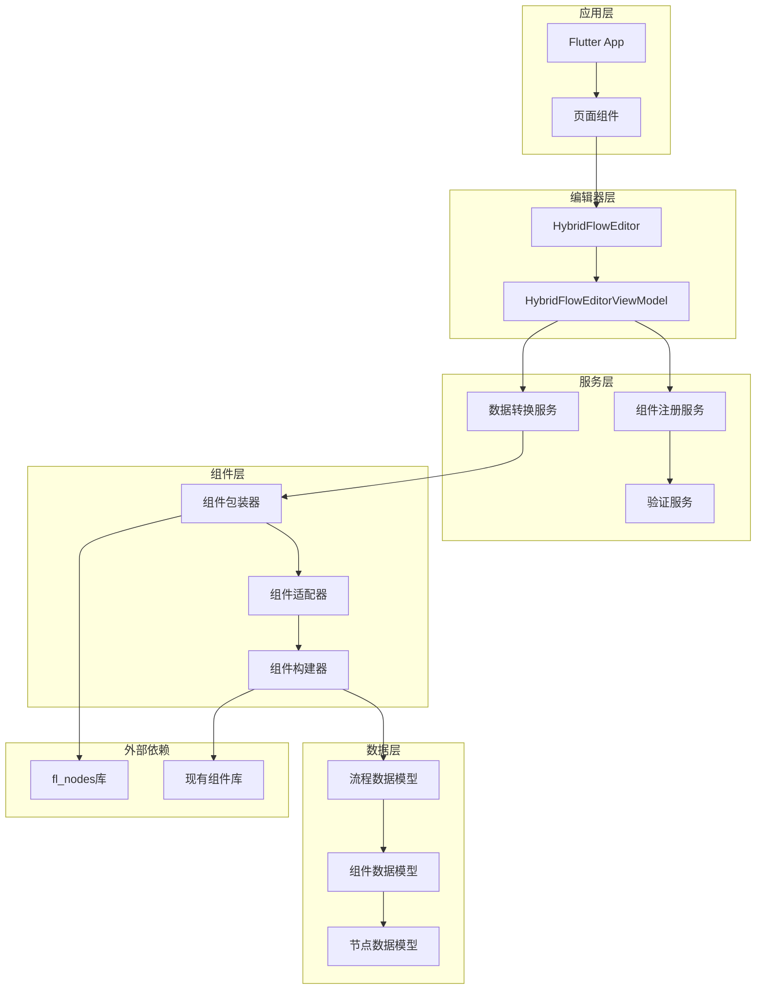

# Flow Pill Card Integration - 架构设计文档

## 文档信息
- **项目**: Flow Pill Card Integration
- **阶段**: Architect (架构设计)
- **创建时间**: 2025-01-25
- **文档状态**: ✅ 架构设计完成

## 1. 整体架构设计

### 1.1 系统架构图



### 1.2 分层设计

#### 核心编辑器层 (Core Editor Layer)
- **HybridFlowEditor**: 主编辑器组件，提供统一的编辑界面
- **HybridFlowEditorViewModel**: 状态管理，处理编辑器状态和数据流
- **HybridFlowEditorFactory**: 工厂类，负责创建和配置编辑器实例

#### 组件注册层 (Component Registry Layer)
- **FlowPillCardRegistry**: 组件注册中心，管理所有可用组件
- **ComponentAdapter**: 组件适配器，统一组件接口
- **ComponentValidator**: 组件验证器，确保组件符合规范

#### 数据转换层 (Data Conversion Layer)
- **FlowPillCardDataConverter**: 核心数据转换器
- **DataMapper**: 数据映射器，处理不同数据格式转换
- **DataSerializer**: 数据序列化器，处理数据持久化

#### 组件包装层 (Component Wrapper Layer)
- **FlowPillCardNodeWrapper**: 组件包装器，将传统组件包装为节点
- **ComponentBuilder**: 组件构建器，动态创建组件实例
- **ComponentRenderer**: 组件渲染器，处理组件显示逻辑

## 2. 核心组件设计

### 2.1 组件注册机制

```dart
class FlowPillCardRegistry {
  static final Map<String, ComponentMetadata> _components = {};
  
  // 注册组件
  static void registerComponent<T extends FlowPillCard>(
    String type,
    ComponentBuilder<T> builder,
    ComponentMetadata metadata,
  ) {
    _components[type] = metadata.copyWith(
      builder: builder,
      validator: _createValidator<T>(),
    );
  }
  
  // 获取组件构建器
  static ComponentBuilder<FlowPillCard>? getBuilder(String type) {
    return _components[type]?.builder;
  }
  
  // 获取所有注册的组件类型
  static List<String> getRegisteredTypes() {
    return _components.keys.toList();
  }
  
  // 验证组件是否有效
  static bool validateComponent(String type, Map<String, dynamic> data) {
    final validator = _components[type]?.validator;
    return validator?.validate(data) ?? false;
  }
}

class ComponentMetadata {
  final String name;
  final String description;
  final String category;
  final List<String> requiredFields;
  final ComponentBuilder? builder;
  final ComponentValidator? validator;
  
  const ComponentMetadata({
    required this.name,
    required this.description,
    required this.category,
    required this.requiredFields,
    this.builder,
    this.validator,
  });
}
```

### 2.2 数据流设计



### 2.3 组件适配设计

```dart
abstract class ComponentAdapter<T extends FlowPillCard> {
  // 将FlowPillCard转换为fl_node
  FlNode toFlNode(T component);
  
  // 将fl_node转换为FlowPillCard
  T fromFlNode(FlNode node);
  
  // 验证组件数据
  bool validate(Map<String, dynamic> data);
  
  // 获取组件默认配置
  Map<String, dynamic> getDefaultConfig();
}

class GenericComponentAdapter<T extends FlowPillCard> extends ComponentAdapter<T> {
  final ComponentBuilder<T> builder;
  final ComponentValidator validator;
  
  GenericComponentAdapter({
    required this.builder,
    required this.validator,
  });
  
  @override
  FlNode toFlNode(T component) {
    return FlNode(
      id: component.id,
      type: component.type,
      data: component.toJson(),
      position: component.position,
    );
  }
  
  @override
  T fromFlNode(FlNode node) {
    return builder.build(node.data);
  }
  
  @override
  bool validate(Map<String, dynamic> data) {
    return validator.validate(data);
  }
}
```

## 3. 接口契约定义

### 3.1 组件接口

```dart
// 基础组件接口
abstract class IFlowPillCard {
  String get id;
  String get type;
  String get title;
  Map<String, dynamic> get data;
  Position get position;
  
  // 数据序列化
  Map<String, dynamic> toJson();
  
  // 组件验证
  bool validate();
  
  // 组件克隆
  IFlowPillCard clone();
}

// 可编辑组件接口
abstract class IEditableFlowPillCard extends IFlowPillCard {
  // 更新数据
  void updateData(Map<String, dynamic> newData);
  
  // 获取编辑器配置
  EditorConfig getEditorConfig();
  
  // 数据变更通知
  Stream<Map<String, dynamic>> get dataChanges;
}

// 可连接组件接口
abstract class IConnectableFlowPillCard extends IFlowPillCard {
  // 输入端口
  List<Port> get inputPorts;
  
  // 输出端口
  List<Port> get outputPorts;
  
  // 连接验证
  bool canConnectTo(IConnectableFlowPillCard target, String outputPort, String inputPort);
}
```

### 3.2 状态管理接口

```dart
// 编辑器状态接口
abstract class IHybridFlowEditorState {
  // 当前编辑的流程
  FlowData get currentFlow;
  
  // 选中的组件
  List<String> get selectedComponents;
  
  // 编辑器模式
  EditorMode get mode;
  
  // 状态变更通知
  Stream<EditorStateChange> get stateChanges;
  
  // 添加组件
  Future<void> addComponent(String type, Position position);
  
  // 删除组件
  Future<void> removeComponent(String componentId);
  
  // 更新组件
  Future<void> updateComponent(String componentId, Map<String, dynamic> data);
  
  // 连接组件
  Future<void> connectComponents(String sourceId, String targetId, String outputPort, String inputPort);
}

// 数据转换接口
abstract class IDataConverter {
  // FlowPillCard转fl_node
  FlNode convertToFlNode(FlowPillCard component);
  
  // fl_node转FlowPillCard
  FlowPillCard convertFromFlNode(FlNode node);
  
  // 批量转换
  List<FlNode> convertToFlNodes(List<FlowPillCard> components);
  List<FlowPillCard> convertFromFlNodes(List<FlNode> nodes);
  
  // 数据验证
  bool validateConversion(FlowPillCard component, FlNode node);
}
```

## 4. 模块依赖关系



## 5. 异常处理策略

### 5.1 组件注册异常

```dart
class ComponentRegistrationException implements Exception {
  final String componentType;
  final String reason;
  
  ComponentRegistrationException(this.componentType, this.reason);
  
  @override
  String toString() => 'Component registration failed for $componentType: $reason';
}

// 异常处理策略
class ComponentRegistrationHandler {
  static void handleRegistrationError(String type, Exception error) {
    // 记录错误日志
    logger.error('Failed to register component $type', error);
    
    // 尝试回退到默认组件
    if (_hasDefaultComponent(type)) {
      _registerDefaultComponent(type);
    }
    
    // 通知用户
    _notifyRegistrationFailure(type, error);
  }
}
```

### 5.2 数据转换异常

```dart
class DataConversionException implements Exception {
  final String sourceType;
  final String targetType;
  final String reason;
  
  DataConversionException(this.sourceType, this.targetType, this.reason);
}

// 数据转换异常处理
class ConversionErrorHandler {
  static T? safeConvert<T>(dynamic source, T Function() converter) {
    try {
      return converter();
    } on DataConversionException catch (e) {
      logger.warning('Data conversion failed: ${e.reason}');
      return null;
    } catch (e) {
      logger.error('Unexpected conversion error', e);
      return null;
    }
  }
}
```

### 5.3 组件验证异常

```dart
class ComponentValidationException implements Exception {
  final String componentId;
  final List<String> validationErrors;
  
  ComponentValidationException(this.componentId, this.validationErrors);
}

// 验证异常处理
class ValidationErrorHandler {
  static bool validateWithFallback(FlowPillCard component) {
    try {
      return component.validate();
    } on ComponentValidationException catch (e) {
      // 记录验证错误
      logger.warning('Component validation failed for ${e.componentId}: ${e.validationErrors}');
      
      // 尝试自动修复
      return _attemptAutoFix(component, e.validationErrors);
    }
  }
}
```

## 6. 性能优化设计

### 6.1 组件懒加载

```dart
class LazyComponentLoader {
  static final Map<String, Future<ComponentBuilder>> _loaders = {};
  
  static Future<ComponentBuilder?> loadComponent(String type) async {
    if (_loaders.containsKey(type)) {
      return await _loaders[type]!;
    }
    
    _loaders[type] = _loadComponentAsync(type);
    return await _loaders[type]!;
  }
  
  static Future<ComponentBuilder> _loadComponentAsync(String type) async {
    // 异步加载组件
    switch (type) {
      case 'basic_input':
        return await _loadBasicInputComponent();
      case 'numeric_calculator':
        return await _loadNumericCalculatorComponent();
      // ... 其他组件类型
      default:
        throw ComponentNotFoundException(type);
    }
  }
}
```

### 6.2 数据缓存策略

```dart
class ComponentDataCache {
  static final LRUCache<String, FlowPillCard> _componentCache = 
      LRUCache<String, FlowPillCard>(maxSize: 100);
  
  static final LRUCache<String, FlNode> _nodeCache = 
      LRUCache<String, FlNode>(maxSize: 100);
  
  static FlowPillCard? getCachedComponent(String id) {
    return _componentCache.get(id);
  }
  
  static void cacheComponent(String id, FlowPillCard component) {
    _componentCache.put(id, component);
  }
  
  static void invalidateCache(String id) {
    _componentCache.remove(id);
    _nodeCache.remove(id);
  }
}
```

### 6.3 渲染优化

```dart
class ComponentRenderOptimizer {
  static Widget buildOptimizedComponent(FlowPillCard component) {
    return RepaintBoundary(
      child: ComponentWidget(
        key: ValueKey(component.id),
        component: component,
        builder: (context, component) {
          return _buildComponentWithMemoization(component);
        },
      ),
    );
  }
  
  static Widget _buildComponentWithMemoization(FlowPillCard component) {
    return useMemoized(
      () => _buildComponentUI(component),
      [component.data, component.position],
    );
  }
}
```

## 7. 质量门控

### 7.1 架构验证清单

- ✅ 架构图清晰准确，层次分明
- ✅ 接口定义完整，契约明确
- ✅ 与现有HybridFlowEditor架构一致
- ✅ 复用现有FlowPillCard组件生态
- ✅ 数据转换机制设计合理
- ✅ 异常处理策略完善
- ✅ 性能优化考虑充分

### 7.2 设计可行性验证

- ✅ 技术方案基于现有代码架构
- ✅ 组件注册机制可扩展
- ✅ 数据转换逻辑可实现
- ✅ 与fl_nodes库兼容
- ✅ 向后兼容现有组件

### 7.3 集成风险评估

- 🟡 **中等风险**: 大量现有组件需要适配
- 🟢 **低风险**: 核心架构基于现有设计
- 🟢 **低风险**: 数据转换机制已有基础实现
- 🟡 **中等风险**: 性能优化需要实际测试验证

## 8. 下一步计划

1. **进入Atomize阶段**: 将架构设计拆分为具体的实现任务
2. **任务优先级**: 先实现核心注册机制，再逐步适配现有组件
3. **验证策略**: 每个模块完成后立即进行集成测试
4. **文档同步**: 实现过程中同步更新技术文档

---

**文档状态**: ✅ 架构设计完成，准备进入原子化阶段