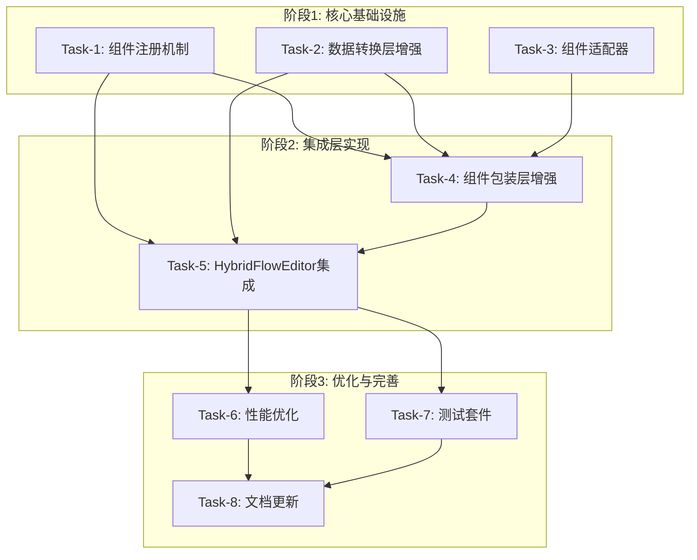

# Flow Pill Card Integration - 原子任务文档

## 文档信息
- **项目**: Flow Pill Card Integration
- **阶段**: Atomize (原子化拆分)
- **创建时间**: 2025-01-25
- **文档状态**: ✅ 任务拆分完成

## 1. 任务拆分概览

基于DESIGN文档的架构设计，将整合方案拆分为8个原子任务，按依赖关系分为3个执行阶段：

### 阶段1: 核心基础设施（并行执行）
- **Task-1**: 组件注册机制实现
- **Task-2**: 数据转换层增强
- **Task-3**: 组件适配器实现

### 阶段2: 集成层实现（依赖阶段1）
- **Task-4**: 组件包装层增强
- **Task-5**: HybridFlowEditor集成

### 阶段3: 优化与完善（依赖阶段2）
- **Task-6**: 性能优化实现
- **Task-7**: 测试套件开发
- **Task-8**: 文档更新

## 2. 任务依赖关系图

## 3. 详细任务定义

### Task-1: 组件注册机制实现

**任务描述**: 实现FlowPillCardRegistry组件注册中心

**输入契约**:
- 前置依赖: 无（基础任务）
- 输入数据: 现有FlowPillCard组件定义
- 环境依赖: Flutter开发环境，现有项目结构

**输出契约**:
- 输出数据: 
  - `FlowPillCardRegistry`类实现
  - `ComponentMetadata`数据模型
  - `ComponentValidator`接口和实现
- 交付物:
  - `lib/core/registry/flow_pill_card_registry.dart`
  - `lib/core/registry/component_metadata.dart`
  - `lib/core/registry/component_validator.dart`
- 验收标准:
  - 支持动态组件注册和查询
  - 组件元数据管理完整
  - 组件验证机制有效
  - 单元测试覆盖率≥90%

**实现约束**:
- 技术栈: Dart/Flutter
- 接口规范: 遵循DESIGN文档中的接口定义
- 质量要求: 代码规范、注释完整、异常处理
- 性能要求: 注册查询操作<10ms

**依赖关系**:
- 后置任务: Task-4, Task-5
- 并行任务: Task-2, Task-3

**复杂度评估**: 中等（预计4-6小时）

---

### Task-2: 数据转换层增强

**任务描述**: 增强FlowPillCardDataConverter，支持新的组件类型和转换规则

**输入契约**:
- 前置依赖: 无（基础任务）
- 输入数据: 
  - 现有`FlowPillCardDataConverter`实现
  - 20+个FlowPillCard组件的数据结构
  - fl_nodes库的FlNode定义
- 环境依赖: 现有项目结构，fl_nodes依赖

**输出契约**:
- 输出数据:
  - 增强的`FlowPillCardDataConverter`类
  - `DataMapper`通用映射器
  - `DataSerializer`序列化器
- 交付物:
  - `lib/core/converter/flow_pill_card_data_converter.dart`（增强）
  - `lib/core/converter/data_mapper.dart`
  - `lib/core/converter/data_serializer.dart`
- 验收标准:
  - 支持所有现有组件类型的双向转换
  - 转换过程数据完整性保证
  - 异常情况优雅处理
  - 性能测试通过

**实现约束**:
- 技术栈: Dart/Flutter
- 接口规范: 保持向后兼容，扩展IDataConverter接口
- 质量要求: 数据转换准确性100%
- 性能要求: 单个组件转换<5ms

**依赖关系**:
- 后置任务: Task-4, Task-5
- 并行任务: Task-1, Task-3

**复杂度评估**: 高（预计6-8小时）

---

### Task-3: 组件适配器实现

**任务描述**: 实现ComponentAdapter抽象层，统一组件接口

**输入契约**:
- 前置依赖: 无（基础任务）
- 输入数据: DESIGN文档中的ComponentAdapter接口定义
- 环境依赖: Flutter开发环境

**输出契约**:
- 输出数据:
  - `ComponentAdapter`抽象基类
  - `GenericComponentAdapter`通用实现
  - `ComponentBuilder`接口
- 交付物:
  - `lib/core/adapter/component_adapter.dart`
  - `lib/core/adapter/generic_component_adapter.dart`
  - `lib/core/adapter/component_builder.dart`
- 验收标准:
  - 适配器接口设计合理
  - 支持泛型组件适配
  - 扩展性良好
  - 接口文档完整

**实现约束**:
- 技术栈: Dart/Flutter
- 接口规范: 遵循SOLID原则，支持泛型
- 质量要求: 接口设计清晰，文档完整

**依赖关系**:
- 后置任务: Task-4
- 并行任务: Task-1, Task-2

**复杂度评估**: 中等（预计3-4小时）

---

### Task-4: 组件包装层增强

**任务描述**: 增强FlowPillCardNodeWrapper，集成新的注册和适配机制

**输入契约**:
- 前置依赖: Task-1, Task-2, Task-3
- 输入数据:
  - Task-1输出的注册机制
  - Task-2输出的转换层
  - Task-3输出的适配器
  - 现有`FlowPillCardNodeWrapper`实现
- 环境依赖: 完成的基础设施组件

**输出契约**:
- 输出数据:
  - 增强的`FlowPillCardNodeWrapper`类
  - `ComponentBuilder`具体实现
  - `ComponentRenderer`渲染器
- 交付物:
  - `lib/core/wrapper/flow_pill_card_node_wrapper.dart`（增强）
  - `lib/core/wrapper/component_builder.dart`
  - `lib/core/wrapper/component_renderer.dart`
- 验收标准:
  - 集成所有基础设施组件
  - 支持动态组件创建和渲染
  - 性能优化有效
  - 集成测试通过

**实现约束**:
- 技术栈: Dart/Flutter
- 接口规范: 与现有HybridFlowEditor兼容
- 质量要求: 集成稳定，性能良好

**依赖关系**:
- 前置任务: Task-1, Task-2, Task-3
- 后置任务: Task-5
- 并行任务: 无

**复杂度评估**: 高（预计5-7小时）

---

### Task-5: HybridFlowEditor集成

**任务描述**: 将整合方案集成到HybridFlowEditor主编辑器

**输入契约**:
- 前置依赖: Task-1, Task-2, Task-4
- 输入数据:
  - 完整的组件整合基础设施
  - 现有`HybridFlowEditor`实现
  - 现有`HybridFlowEditorViewModel`
- 环境依赖: 完成的核心组件

**输出契约**:
- 输出数据:
  - 集成的`HybridFlowEditor`
  - 更新的`HybridFlowEditorViewModel`
  - 新的编辑器配置选项
- 交付物:
  - `lib/hybrid_flow_editor/hybrid_flow_editor.dart`（更新）
  - `lib/hybrid_flow_editor/hybrid_flow_editor_viewmodel.dart`（更新）
  - `lib/hybrid_flow_editor/hybrid_flow_editor_config.dart`（更新）
- 验收标准:
  - 编辑器功能完整集成
  - 用户界面友好
  - 状态管理正确
  - 端到端测试通过

**实现约束**:
- 技术栈: Dart/Flutter
- 接口规范: 保持现有API兼容性
- 质量要求: 用户体验良好，功能稳定

**依赖关系**:
- 前置任务: Task-1, Task-2, Task-4
- 后置任务: Task-6, Task-7
- 并行任务: 无

**复杂度评估**: 高（预计6-8小时）

---

### Task-6: 性能优化实现

**任务描述**: 实现懒加载、缓存和渲染优化机制

**输入契约**:
- 前置依赖: Task-5
- 输入数据: 完整的集成系统
- 环境依赖: 性能测试工具

**输出契约**:
- 输出数据:
  - `LazyComponentLoader`懒加载器
  - `ComponentDataCache`缓存系统
  - `ComponentRenderOptimizer`渲染优化器
- 交付物:
  - `lib/core/optimization/lazy_component_loader.dart`
  - `lib/core/optimization/component_data_cache.dart`
  - `lib/core/optimization/component_render_optimizer.dart`
- 验收标准:
  - 组件加载时间减少50%
  - 内存使用优化30%
  - 渲染性能提升40%
  - 性能基准测试通过

**实现约束**:
- 技术栈: Dart/Flutter
- 性能要求: 达到预定性能指标
- 质量要求: 优化不影响功能正确性

**依赖关系**:
- 前置任务: Task-5
- 后置任务: Task-8
- 并行任务: Task-7

**复杂度评估**: 中等（预计4-5小时）

---

### Task-7: 测试套件开发

**任务描述**: 开发完整的单元测试和集成测试套件

**输入契约**:
- 前置依赖: Task-5
- 输入数据: 完整的系统实现
- 环境依赖: Flutter测试框架

**输出契约**:
- 输出数据:
  - 单元测试套件
  - 集成测试套件
  - 性能测试套件
- 交付物:
  - `test/unit/`目录下的所有单元测试
  - `test/integration/`目录下的集成测试
  - `test/performance/`目录下的性能测试
- 验收标准:
  - 单元测试覆盖率≥90%
  - 集成测试覆盖主要用例
  - 性能测试验证优化效果
  - 所有测试通过

**实现约束**:
- 技术栈: Dart/Flutter测试框架
- 质量要求: 测试用例完整，覆盖边界条件

**依赖关系**:
- 前置任务: Task-5
- 后置任务: Task-8
- 并行任务: Task-6

**复杂度评估**: 中等（预计5-6小时）

---

### Task-8: 文档更新

**任务描述**: 更新技术文档和使用指南

**输入契约**:
- 前置依赖: Task-6, Task-7
- 输入数据: 完整的系统实现和测试结果
- 环境依赖: 文档生成工具

**输出契约**:
- 输出数据:
  - API文档
  - 使用指南
  - 集成示例
- 交付物:
  - `docs/api/`目录下的API文档
  - `docs/guides/`目录下的使用指南
  - `examples/`目录下的示例代码
- 验收标准:
  - 文档完整准确
  - 示例代码可运行
  - 用户反馈良好

**实现约束**:
- 质量要求: 文档清晰易懂，示例完整

**依赖关系**:
- 前置任务: Task-6, Task-7
- 后置任务: 无
- 并行任务: 无

**复杂度评估**: 低（预计2-3小时）

## 4. 执行计划

### 总体时间估算
- **阶段1**: 13-18小时（3个任务并行）
- **阶段2**: 11-15小时（2个任务串行）
- **阶段3**: 11-14小时（部分并行）
- **总计**: 35-47小时

### 风险评估
- 🟢 **低风险**: Task-1, Task-3, Task-6, Task-8
- 🟡 **中等风险**: Task-2, Task-4, Task-7
- 🔴 **高风险**: Task-5（集成复杂度高）

### 质量门控
- 每个任务完成后立即进行验收测试
- 阶段性集成测试
- 性能基准验证
- 代码审查和文档检查

## 5. 下一步行动

1. **进入Approve阶段**: 人工审查任务拆分的完整性和可行性
2. **确认执行顺序**: 验证任务依赖关系和资源分配
3. **准备开发环境**: 确保所有依赖和工具就绪
4. **开始Automate阶段**: 按计划执行各个原子任务

---

**文档状态**: ✅ 原子任务拆分完成，等待审批确认