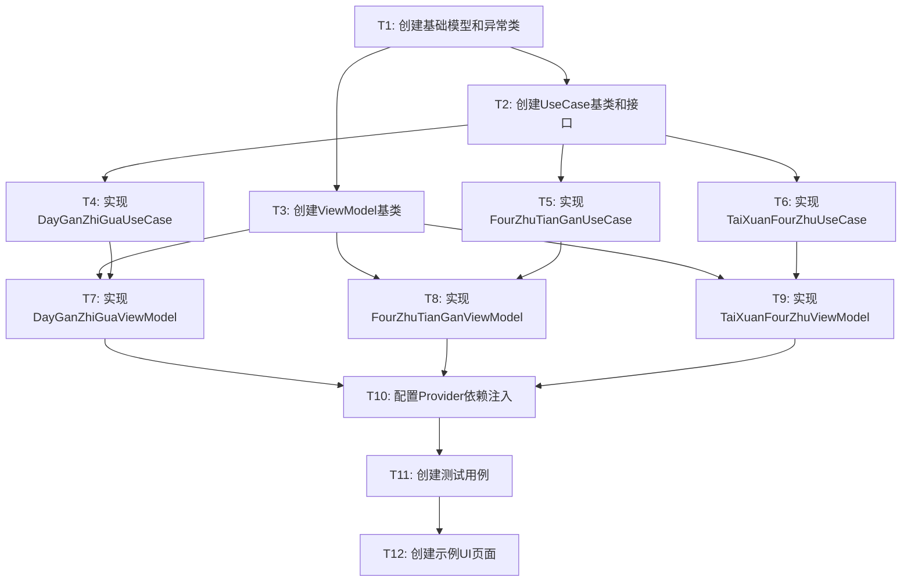

# MVVM+UseCase Strategy实现 - 任务拆分文档

## 任务概览

基于对齐和架构设计，将MVVM+UseCase实现拆分为以下原子任务，使用Provider进行依赖注入，并使用`DevConstant.dev_usa`作为开发数据。

## 任务依赖关系图



## 原子任务详细定义

### T1: 创建基础模型和异常类

**输入契约**:
- 现有项目结构
- 对齐文档中的数据模型需求

**输出契约**:
- `lib/domain/models/tiao_wen_list_result.dart` - 条文列表结果模型
- `lib/domain/models/tiao_wen_list_state.dart` - UI状态枚举
- `lib/domain/exceptions/tiao_wen_calculation_exceptions.dart` - 异常类定义

**实现约束**:
- 使用现有项目的代码风格
- 模型类需要包含`copyWith`、`toString`、`==`和`hashCode`方法
- 异常类需要继承自`Exception`

**验收标准**:
- 所有模型类编译通过
- 异常类可以正确抛出和捕获
- 代码符合项目规范

### T2: 创建UseCase基类和接口

**输入契约**:
- T1的输出（基础模型和异常类）
- 现有Strategy接口
- TiaoWenListCalculator和Repository接口

**输出契约**:
- `lib/application/usecases/base_get_tiao_wen_list_use_case.dart` - UseCase基类
- 三个具体UseCase的抽象接口定义

**实现约束**:
- UseCase需要是泛型类，支持不同的参数类型
- 需要定义统一的`execute`方法签名
- 错误处理需要统一

**验收标准**:
- 基类和接口编译通过
- 接口设计清晰，易于实现
- 支持异步操作

### T3: 创建ViewModel基类

**输入契约**:
- T1的输出（基础模型和状态枚举）
- Flutter的ChangeNotifier

**输出契约**:
- `lib/presentation/viewmodels/base_tiao_wen_list_view_model.dart` - ViewModel基类

**实现约束**:
- 继承自`ChangeNotifier`
- 管理加载、成功、错误状态
- 提供统一的状态管理方法
- 支持异步操作和错误处理

**验收标准**:
- 基类编译通过
- 状态管理逻辑正确
- 内存泄漏检查通过

### T4: 实现DayGanZhiGuaUseCase

**输入契约**:
- T2的输出（UseCase基类）
- 现有的`DayGanZhiGuaStrategy`
- `TiaoWenListCalculator`和`TiaoWenRepository`

**输出契约**:
- `lib/application/usecases/get_day_gan_zhi_gua_tiao_wen_list_use_case.dart`

**实现约束**:
- 使用`DevConstant.dev_usa`中的日柱数据作为输入
- 调用Strategy获取baseNumber
- 使用适当的条文列表计算配置
- 通过Repository获取条文数据
- 完整的错误处理

**验收标准**:
- UseCase能正确执行完整流程
- 错误处理覆盖所有异常情况
- 返回正确的条文列表结果

### T5: 实现FourZhuTianGanUseCase

**输入契约**:
- T2的输出（UseCase基类）
- 现有的`FourZhuTianGanStrategy`
- `TiaoWenListCalculator`和`TiaoWenRepository`

**输出契约**:
- `lib/application/usecases/get_four_zhu_tian_gan_tiao_wen_list_use_case.dart`

**实现约束**:
- 使用`DevConstant.dev_usa`中的四柱数据作为输入
- 使用递加96七次的计算配置
- 完整的错误处理

**验收标准**:
- UseCase能正确执行完整流程
- 计算配置正确（递加96七次）
- 返回正确的条文列表结果

### T6: 实现TaiXuanFourZhuUseCase

**输入契约**:
- T2的输出（UseCase基类）
- 现有的`TaiXuanFourZhuStrategy`
- `TiaoWenListCalculator`和`TiaoWenRepository`

**输出契约**:
- `lib/application/usecases/get_tai_xuan_four_zhu_tiao_wen_list_use_case.dart`

**实现约束**:
- 使用`DevConstant.dev_usa`中的四柱数据作为输入
- 处理四个基础数的条文列表计算
- 完整的错误处理

**验收标准**:
- UseCase能正确处理多个基础数
- 返回合并后的条文列表结果
- 错误处理完善

### T7: 实现DayGanZhiGuaViewModel

**输入契约**:
- T3的输出（ViewModel基类）
- T4的输出（DayGanZhiGuaUseCase）

**输出契约**:
- `lib/presentation/viewmodels/day_gan_zhi_gua_view_model.dart`

**实现约束**:
- 继承自ViewModel基类
- 管理UI状态和数据
- 调用UseCase执行业务逻辑
- 错误处理和用户友好的错误信息

**验收标准**:
- ViewModel状态管理正确
- 异步操作处理得当
- UI数据绑定正确

### T8: 实现FourZhuTianGanViewModel

**输入契约**:
- T3的输出（ViewModel基类）
- T5的输出（FourZhuTianGanUseCase）

**输出契约**:
- `lib/presentation/viewmodels/four_zhu_tian_gan_view_model.dart`

**实现约束**:
- 继承自ViewModel基类
- 管理UI状态和数据
- 调用UseCase执行业务逻辑

**验收标准**:
- ViewModel功能完整
- 状态管理正确
- 错误处理完善

### T9: 实现TaiXuanFourZhuViewModel

**输入契约**:
- T3的输出（ViewModel基类）
- T6的输出（TaiXuanFourZhuUseCase）

**输出契约**:
- `lib/presentation/viewmodels/tai_xuan_four_zhu_view_model.dart`

**实现约束**:
- 继承自ViewModel基类
- 处理多个基础数的UI展示
- 管理复杂的状态逻辑

**验收标准**:
- ViewModel能正确处理复杂数据
- UI状态管理清晰
- 用户体验良好

### T10: 配置Provider依赖注入

**输入契约**:
- T4-T9的输出（所有UseCase和ViewModel）
- 现有的Provider配置（main.dart）

**输出契约**:
- 更新`lib/main.dart`中的Provider配置
- 创建`lib/infrastructure/di/strategy_providers.dart` - 依赖注入配置

**实现约束**:
- 使用现有的Provider模式
- 保持与现有依赖注入的一致性
- 最小化代码修改
- 使用单例模式管理Strategy实例

**验收标准**:
- 所有依赖正确注入
- 应用启动正常
- 依赖关系清晰
- 无循环依赖

### T11: 创建测试用例

**输入契约**:
- T1-T10的所有输出
- 现有的测试框架和模式

**输出契约**:
- `test/application/usecases/` - UseCase测试
- `test/presentation/viewmodels/` - ViewModel测试
- `test/integration/` - 集成测试

**实现约束**:
- 使用现有的测试框架
- 覆盖主要业务逻辑
- Mock外部依赖
- 测试异常情况

**验收标准**:
- 测试覆盖率 > 80%
- 所有测试通过
- 测试用例清晰易懂
- 包含边界条件测试

### T12: 创建示例UI页面

**输入契约**:
- T10的输出（完整的依赖注入配置）
- 现有的UI组件和样式

**输出契约**:
- `lib/presentation/pages/strategy_demo_page.dart` - 演示页面
- 更新路由配置

**实现约束**:
- 使用现有的UI风格
- 展示三个Strategy的计算结果
- 提供简单的交互界面
- 错误状态的友好展示

**验收标准**:
- UI页面正常显示
- 功能交互正常
- 错误处理用户友好
- 符合项目UI规范

## 实施策略

### 开发数据使用
所有任务都使用`DevConstant.dev_usa`作为开发数据：
- **四柱数据**: `dev_usa.standeredChineseInfo.eightChars`
- **日柱数据**: `dev_usa.standeredChineseInfo.eightChars.day`
- **时间信息**: `dev_usa.standeredDatetime`

### Provider配置策略
```dart
// 在main.dart中添加
MultiProvider(
  providers: [
    // 现有providers...
    
    // Strategy providers
    Provider<DayGanZhiGuaStrategy>(
      create: (_) => DayGanZhiGuaStrategy(),
    ),
    Provider<FourZhuTianGanStrategy>(
      create: (_) => FourZhuTianGanStrategy(),
    ),
    Provider<TaiXuanFourZhuStrategy>(
      create: (_) => TaiXuanFourZhuStrategy(),
    ),
    
    // UseCase providers
    Provider<GetDayGanZhiGuaTiaoWenListUseCase>(
      create: (context) => GetDayGanZhiGuaTiaoWenListUseCaseImpl(
        strategy: context.read<DayGanZhiGuaStrategy>(),
        repository: context.read<TiaoWenRepository>(),
      ),
    ),
    
    // ViewModel providers
    ChangeNotifierProvider<DayGanZhiGuaViewModel>(
      create: (context) => DayGanZhiGuaViewModel(
        useCase: context.read<GetDayGanZhiGuaTiaoWenListUseCase>(),
      ),
    ),
  ],
  child: MyApp(),
)
```

### 质量保证
- 每个任务完成后立即进行单元测试
- 代码审查确保符合项目规范
- 集成测试验证端到端流程
- 性能测试确保响应速度

## 风险评估

### 技术风险
- **低风险**: 基础模型和异常类创建
- **中风险**: UseCase业务逻辑实现
- **中风险**: Provider依赖注入配置
- **低风险**: ViewModel状态管理

### 缓解策略
- 优先实现核心功能，后续优化
- 充分利用现有代码和模式
- 分阶段测试，及时发现问题
- 保持代码简洁，避免过度设计