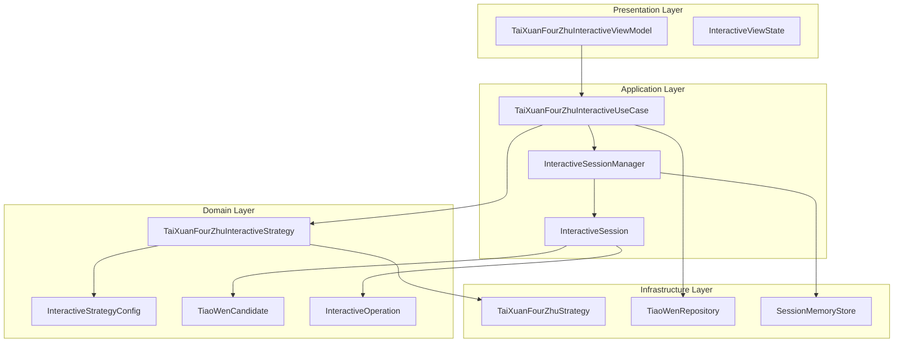
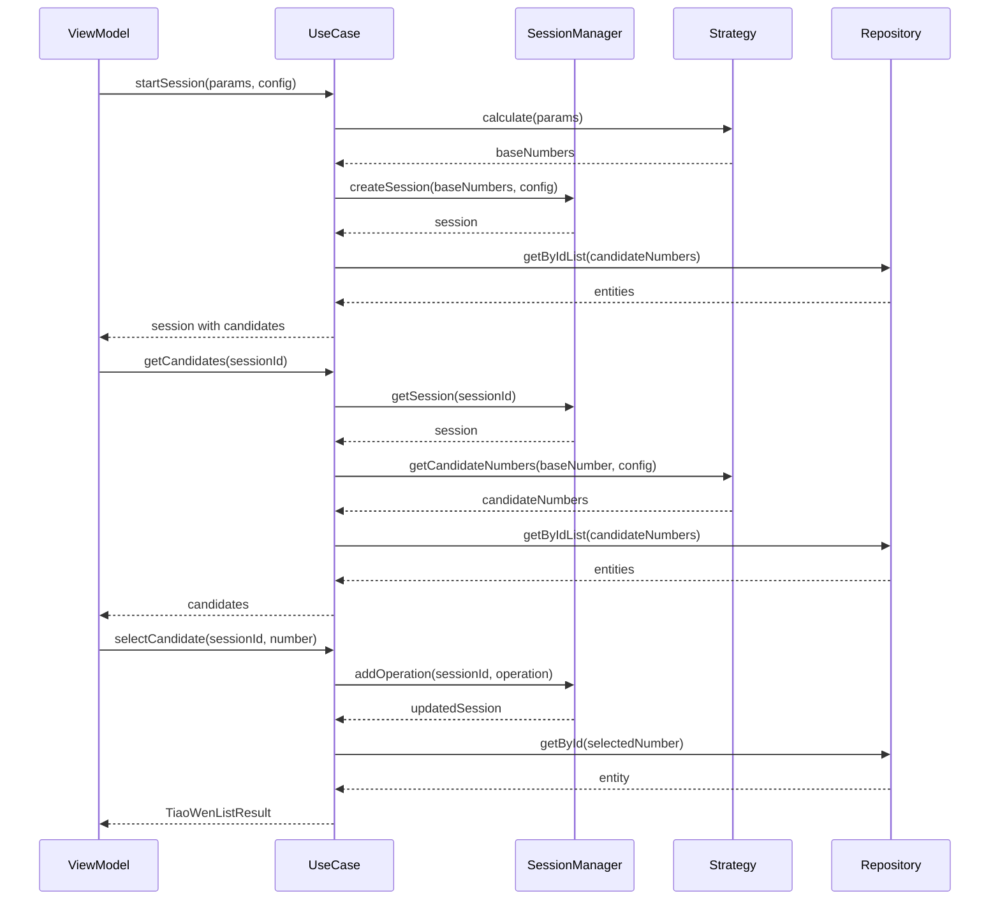

# 太玄四柱Interactive模式迁移 - 架构设计文档

## 整体架构图

## 分层设计

### 1. Domain Layer (领域层)

#### 1.1 Interactive Strategy 基础接口

核心配置类和枚举：
- `InteractiveStrategyConfig`: 交互配置（步长、候选数量、调整方向等）
- `AdjustmentDirection`: 调整方向枚举（双向、仅增加、仅减少）
- `BaseInteractiveStrategy`: Interactive Strategy基类

#### 1.2 会话管理模型

核心模型类：
- `InteractiveSession`: 会话状态管理
- `TiaoWenCandidate`: 候选条文封装
- `InteractiveOperation`: 操作历史记录
- 相关枚举：`InteractiveSessionState`、`CandidateType`、`OperationType`

### 2. Application Layer (应用层)

#### 2.1 Interactive UseCase 接口

- `BaseInteractiveUseCase`: 定义交互式UseCase的标准接口
- `InteractiveSessionManager`: 会话管理器接口
- 核心功能：会话创建、候选获取、条文选择、操作撤销

### 3. Infrastructure Layer (基础设施层)

#### 3.1 会话存储

- `SessionStore`: 会话存储抽象接口
- `SessionMemoryStore`: 内存存储实现（首期使用）

## 核心组件设计

### 1. TaiXuanFourZhuInteractiveStrategy

继承`BaseInteractiveStrategy`，实现太玄四柱的交互式计算：
- 复用现有的`TaiXuanFourZhuStrategy`进行基础计算
- 实现候选数字生成逻辑
- 提供数字有效性验证

### 2. TaiXuanFourZhuInteractiveUseCase

继承`BaseInteractiveUseCase`，实现具体的业务逻辑：
- 会话生命周期管理
- 候选条文生成和管理
- 用户选择处理
- 操作历史记录

## 接口契约定义

### 输入契约
- `TaiXuanFourZhuUseCaseParams`: EightChars对象
- `InteractiveStrategyConfig`: 交互配置参数
- 会话ID: 字符串格式唯一标识

### 输出契约
- `InteractiveSession`: 完整会话状态
- `List<TiaoWenCandidate>`: 候选条文列表
- `TiaoWenListResult`: 最终选择结果

### 异常契约
- `InteractiveSessionNotFoundException`: 会话不存在
- `InvalidConfigurationException`: 配置无效
- `OperationNotAllowedException`: 操作不被允许

## 数据流向图

## 与现有架构的集成

### 1. 复用现有组件
- **TaiXuanFourZhuStrategy**: 作为基础计算引擎
- **TiaoWenRepository**: 条文数据访问
- **TiaoWenEntity**: 条文实体模型
- **EightChars**: 八字参数模型

### 2. 扩展点设计
- **Provider配置**: 扩展`StrategyProviders`支持Interactive组件
- **错误处理**: 复用现有异常处理机制
- **测试框架**: 复用现有测试基础设施

### 3. 向后兼容
- Standard模式保持不变
- Interactive模式作为可选功能
- 可在同一应用中并行使用

## 异常处理策略

### 1. 会话管理异常
- 会话不存在：明确错误信息，引导重新开始
- 会话过期：自动清理，提示重新创建
- 并发访问：乐观锁机制

### 2. 数据访问异常
- Repository异常：降级处理，返回部分数据
- 网络异常：重试机制，超时返回错误

### 3. 配置异常
- 无效配置：使用默认配置并记录警告
- 边界越界：自动调整到有效范围

## 性能考虑

### 1. 内存管理
- 会话数据定期清理
- 候选条文按需加载
- 操作历史限制数量

### 2. 数据库访问
- 批量查询条文实体
- 结果缓存机制
- 连接池管理

### 3. 计算优化
- 候选数字预计算
- 重复计算缓存
- 异步处理非关键路径

## 质量保证

### 1. 代码质量
- 遵循现有代码规范
- 完整的类型定义
- 充分的注释文档

### 2. 测试策略
- 单元测试覆盖核心逻辑
- 集成测试验证数据流
- 边界条件和异常情况测试

### 3. 可维护性
- 清晰的分层架构
- 松耦合的组件设计
- 可扩展的接口定义