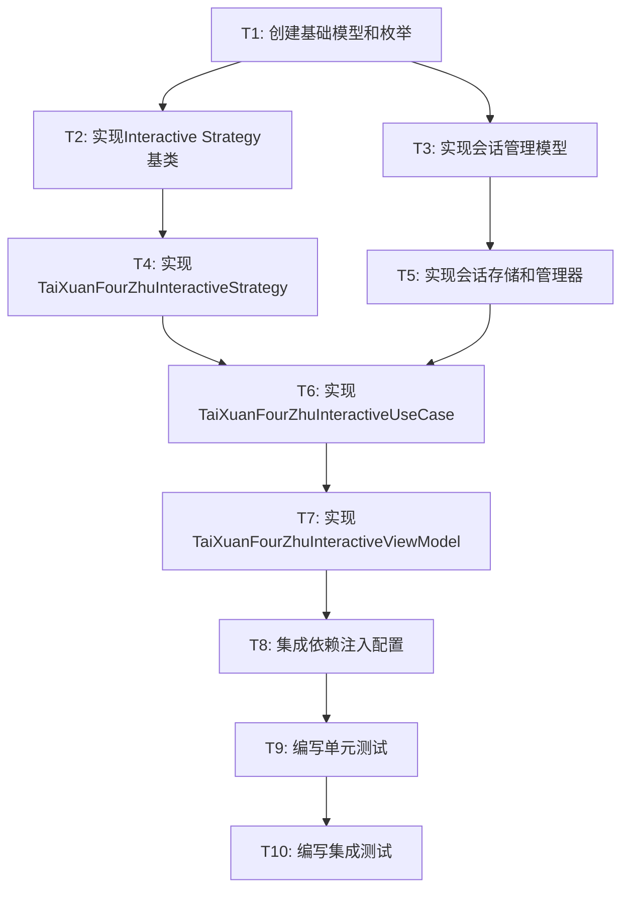

# 太玄四柱Interactive模式迁移 - 任务拆分文档

## 任务依赖图

## 任务详细定义

### T1: 创建基础模型和枚举
**优先级**: 高 | **预估时间**: 2小时 | **复杂度**: 低

#### 输入契约
- 现有的BaseCalculationStrategy接口
- 现有的枚举定义模式
- DESIGN文档中的模型定义

#### 输出契约
- `lib/domain/models/interactive_strategy_config.dart`
- `lib/domain/models/interactive_session.dart`
- `lib/domain/models/tiao_wen_candidate.dart`
- `lib/domain/models/interactive_operation.dart`
- `lib/domain/enums/interactive_enums.dart`

#### 验收标准
- [ ] 所有模型类编译通过
- [ ] 包含完整的构造函数和工厂方法
- [ ] 提供合理的默认值
- [ ] 枚举定义清晰完整
- [ ] 文档注释完整

---

### T2: 实现Interactive Strategy基类
**优先级**: 高 | **预估时间**: 3小时 | **复杂度**: 中

#### 输入契约
- T1的输出：基础模型和枚举
- 现有的BaseCalculationStrategy接口

#### 输出契约
- `lib/service/strategy/base_interactive_strategy.dart`

#### 验收标准
- [ ] 基类接口定义完整
- [ ] 候选数字生成逻辑正确
- [ ] 数字有效性验证功能完善
- [ ] 与现有Strategy接口兼容

---

### T3: 实现会话管理模型
**优先级**: 高 | **预估时间**: 4小时 | **复杂度**: 中

#### 输入契约
- T1的输出：基础模型定义
- 现有的Repository模式

#### 输出契约
- `lib/infrastructure/session/session_store.dart`
- `lib/infrastructure/session/session_memory_store.dart`
- `lib/application/session/interactive_session_manager.dart`

#### 验收标准
- [ ] SessionStore接口定义完整
- [ ] 内存存储实现功能完善
- [ ] 会话管理器功能完整
- [ ] 操作历史记录正确
- [ ] 撤销功能正常工作

---

### T4: 实现TaiXuanFourZhuInteractiveStrategy
**优先级**: 高 | **预估时间**: 3小时 | **复杂度**: 中

#### 输入契约
- T2的输出：Interactive Strategy基类
- 现有的TaiXuanFourZhuStrategy实现

#### 输出契约
- `lib/service/strategy/tai_xuan_four_zhu_interactive_strategy.dart`

#### 验收标准
- [ ] 继承关系正确
- [ ] 基础计算结果与Standard版本一致
- [ ] 候选数字生成逻辑正确
- [ ] 边界检查功能完善

---

### T5: 实现会话存储和管理器
**优先级**: 中 | **预估时间**: 2小时 | **复杂度**: 低

#### 输入契约
- T3的输出：会话管理接口

#### 输出契约
- 完善T3中的实现
- 添加会话清理机制

#### 验收标准
- [ ] 并发访问安全
- [ ] 内存使用合理
- [ ] 会话清理机制正常

---

### T6: 实现TaiXuanFourZhuInteractiveUseCase
**优先级**: 高 | **预估时间**: 5小时 | **复杂度**: 高

#### 输入契约
- T4的输出：TaiXuanFourZhuInteractiveStrategy
- T5的输出：会话管理器
- 现有的TiaoWenRepository

#### 输出契约
- `lib/usecases/tai_xuan_four_zhu_interactive_use_case.dart`
- `lib/application/usecases/base_interactive_use_case.dart`

#### 验收标准
- [ ] 会话创建和管理功能完整
- [ ] 候选条文获取正确
- [ ] 条文选择功能正常
- [ ] 操作撤销功能完善
- [ ] 异常处理完善

---

### T7: 实现TaiXuanFourZhuInteractiveViewModel
**优先级**: 高 | **预估时间**: 4小时 | **复杂度**: 中

#### 输入契约
- T6的输出：TaiXuanFourZhuInteractiveUseCase
- 现有的ViewModel基类

#### 输出契约
- `lib/presentation/viewmodels/tai_xuan_four_zhu_interactive_view_model.dart`
- `lib/presentation/viewmodels/base_interactive_view_model.dart`

#### 验收标准
- [ ] 状态管理功能完整
- [ ] UI数据绑定正确
- [ ] 用户操作响应及时
- [ ] 错误状态处理完善

---

### T8: 集成依赖注入配置
**优先级**: 中 | **预估时间**: 2小时 | **复杂度**: 低

#### 输入契约
- T7的输出：完整的Interactive组件
- 现有的StrategyProviders配置

#### 输出契约
- 更新`lib/infrastructure/di/strategy_providers.dart`

#### 验收标准
- [ ] Provider配置正确
- [ ] 依赖注入链完整
- [ ] 与现有配置无冲突

---

### T9: 编写单元测试
**优先级**: 中 | **预估时间**: 6小时 | **复杂度**: 中

#### 输入契约
- T1-T8的所有输出
- 现有的测试框架

#### 输出契约
- 各组件的单元测试文件

#### 验收标准
- [ ] Strategy层测试覆盖完整
- [ ] UseCase层测试覆盖完整
- [ ] ViewModel层测试覆盖完整
- [ ] 所有测试通过

---

### T10: 编写集成测试
**优先级**: 低 | **预估时间**: 3小时 | **复杂度**: 中

#### 输入契约
- T9的输出：完整的单元测试

#### 输出契约
- `test/integration/tai_xuan_interactive_integration_test.dart`

#### 验收标准
- [ ] 完整流程测试通过
- [ ] 组件集成测试正确
- [ ] 性能测试满足要求

## 总体时间估算
- **总工作量**: 31小时
- **关键路径**: T1 → T2 → T4 → T6 → T7 → T8 (19小时)
- **预计完成时间**: 3-4个工作日